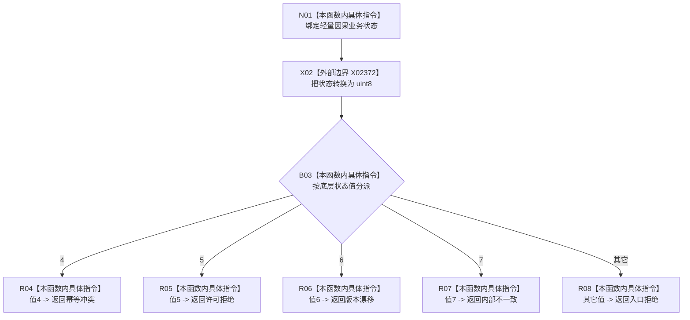

# CF-L7-0123 系统角色初始化器映射轻量因果业务状态现状流程图

图类型：现状流程图
代码版本：`03a8b7ac099ccea83e57f2696e2290b7bcdfacaf`
当前工作区复核基线：`8632fb891fb3beea255aff1946c07b0fe975ef2b`
源码 blob：`adf3fb33c53aa5aeaff2f7102bc9a4d7db3ba040`
覆盖文件：`海中鱼巣/领域/初始化.系统角色.ixx:193-202`
唯一根函数：R0725
完整签名：`海中鱼巣::系统角色业务状态 海中鱼巣::系统角色初始化器::映射业务状态<海中鱼巣::轻量因果业务状态>(海中鱼巣::轻量因果业务状态 状态) noexcept`
参数：`状态` 按值输入，为轻量因果业务状态特化实参
返回结果：枚举底层值4/5/6/7映射为幂等冲突/许可拒绝/版本漂移/内部不一致，其它值返回入口拒绝
调用图：`流程图/主程序可达调用关系/01_main可达项目调用边表.md`
逐行映射表：`流程图/代码流程图/L7/CF-L7-0123_系统角色初始化器映射轻量因果业务状态_逐行代码映射表.md`
输入契约 / 调用语境表：本图“当前边界”节；未另建独立表
非成功返回二分审查表：全部输出均为 F0455 消费的非成功状态映射；内部不一致保持追根因语义
偏差清单：无 / 不适用；本图只登记当前实现事实
依据提交 / 结构化消息：源码冻结 `03a8b7ac099ccea83e57f2696e2290b7bcdfacaf`；无结构化执行消息
验证输出：配对逐行映射、节点集合、源码 blob 与本批机械审计
已登记调用方：F0455（RCE1877）
直接项目函数：无
外部边界：X02372（把轻量因果业务状态转换为 uint8）
结构读写：无；只转换并映射枚举状态
不得作为施工许可：是
不得宣称：默认分支对应某个唯一来源状态，或状态根因已经处理

## 流程图

## 当前边界

- 本身份是模板函数针对轻量因果业务状态的可达特化，不代表其它状态类型的映射实例。
- 该映射只在轻量因果创建结果非成功时由 F0455 使用。
