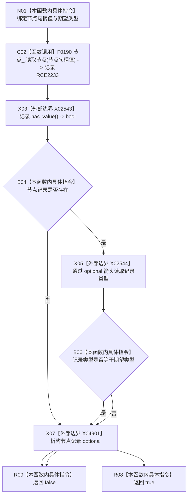

# CF-L7-0127 需求服务节点类型匹配现状流程图

图类型：现状流程图
代码版本：`03a8b7ac099ccea83e57f2696e2290b7bcdfacaf`
当前工作区复核基线：`8632fb891fb3beea255aff1946c07b0fe975ef2b`
源码 blob：`e41b0c665b360232e55ede728f2a4d561c5c9d32`
覆盖文件：`海中鱼巣/领域/需求服务.h:1038-1041`
唯一根函数：R0729
完整签名：`bool 海中鱼巣::需求服务::节点类型匹配(海中鱼巣::节点句柄 节点句柄值, 海中鱼巣::节点类型 类型) const`
参数：`节点句柄值` 与期望 `类型` 均按值输入
返回结果：无令牌读取获得节点记录且记录类型等于期望类型时返回 true，否则返回 false
调用图：`流程图/主程序可达调用关系/01_main可达项目调用边表.md`
逐行映射表：`流程图/代码流程图/L7/CF-L7-0127_需求服务节点类型匹配_逐行代码映射表.md`
输入契约 / 调用语境表：本图“当前边界”节；未另建独立表
非成功返回二分审查表：记录不存在或类型不匹配均返回 false；调用方按各自入口语境裁决
偏差清单：无 / 不适用；本图只登记当前实现事实
依据提交 / 结构化消息：源码冻结 `03a8b7ac099ccea83e57f2696e2290b7bcdfacaf`；无结构化执行消息
验证输出：配对逐行映射、节点集合、源码 blob 与本批机械审计
已登记调用方：F0552、R0579、R0581、R0587、R0593、R0596、R0597、R0576、R0577（RCE2220、RCE2225—RCE2232）
直接项目函数：F0190（RCE2233）
外部边界：X02543、X02544、X04901（optional 检查、箭头访问与析构）
结构读写：只读节点记录，不改变需求或节点结构
不得作为施工许可：是
不得宣称：false 能区分节点不存在与类型不匹配，或所有调用方具有相同输入契约

## 流程图

## 当前边界

- 多个需求服务入口复用本谓词，但各调用方传入的期望类型和对 false 的收口语境不同。
- X04901 在真假返回前释放局部 optional；本函数不持有节点记录。
