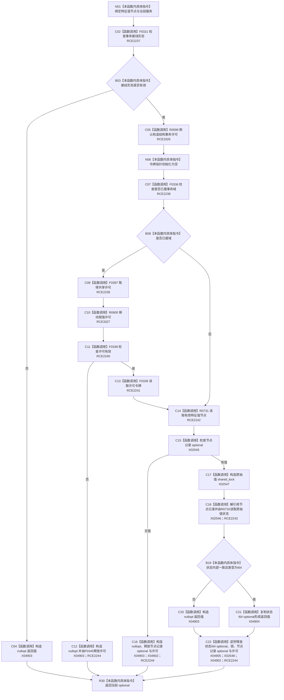

# CF-L7-0128 特征值服务读取 I64 值现状流程图

图类型：现状流程图
代码版本：`03a8b7ac099ccea83e57f2696e2290b7bcdfacaf`
当前工作区复核基线：`8632fb891fb3beea255aff1946c07b0fe975ef2b`
源码 blob：`be8c82c78253b3bc7d3f4aa15a93660e0025bb06`
覆盖文件：`海中鱼巣/领域/特征值服务.h:268-288`
唯一根函数：R0730
完整签名：`std::optional<std::int64_t> 海中鱼巣::特征值服务::读取I64值(海中鱼巣::节点句柄 特征值节点) const`
参数：`特征值节点` 按值传入；只读当前服务、事务接线和仓库，必要时持有共享许可与原始值共享锁
返回结果：接线、许可、节点与 I64 原始值状态全部有效时返回 I64 optional；任一拒绝或不一致时返回 `std::nullopt`
调用图：`流程图/主程序可达调用关系/00_main可达函数身份表.md`、`01_main可达项目调用边表.md`、`02_main可达外部边界表.md`
已登记调用方：F0555（RCE2236）
直接项目函数：F0321（RCE2237）、F0336（RCE2238）、F0397（RCE2239）、F0338（RCE2240）、F0339（RCE2241）、R0731（RCE2242）、R0732（RCE2243）、F0345（RCE2244）、R0599（RCE3326）、R0600（RCE3327）
外部边界：X02545—X02548、X04902—X04905
逐行映射表：`流程图/代码流程图/L7/CF-L7-0128_特征值服务读取I64值_逐行代码映射表.md`
输入契约 / 调用语境表：本图内嵌审查；由特征服务在确认特征值服务存在后读取指定特征值节点
非成功返回二分审查表：接线或许可失败为入口/资源拒绝；节点错误、原始值内部不一致或类型不匹配统一折叠为空 optional
偏差清单：补登记 RCE3326、RCE3327 与 X04902—X04905；本图只记录当前实现折叠口径，不授权修改
依据提交 / 结构化消息：冻结源码提交 `03a8b7ac099ccea83e57f2696e2290b7bcdfacaf`、正式稳定边表及顶层稳定 ID 裁决
验证输出：Mermaid / 节点集合 / 逐行覆盖 PASS；目标 no-index 与 strict 检查 PASS；未构建、未运行
不得作为施工许可：是
不得宣称：空 optional 的具体根因可由返回值区分，或读取结果已经通过运行验证

## 流程图

## 当前边界

- 未接域时令牌保持空指针并走无令牌读取；已接域时共享许可覆盖后续全部返回路径。
- 本函数把接线、许可、节点、内部一致性和类型失败都折叠为空 optional。
