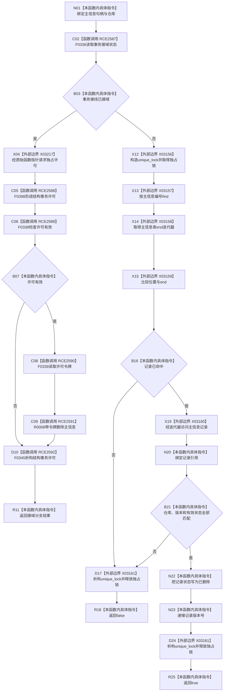

# CF-L7-0129 主信息仓库删除主信息无令牌重载现状流程图

图类型：现状流程图
代码版本：`03a8b7ac099ccea83e57f2696e2290b7bcdfacaf`
当前工作区复核基线：`ef4f7bda76c92c0eb11456cfa267d76f35810616`
源码 blob：`11f8fa53ff961a8cbaac34cf75b69a22533ca907`
覆盖文件：`海中鱼巣/核心/主信息仓库.cpp:293-310`
唯一根函数：R0761
完整签名：`bool 海中鱼巣::主信息仓库::删除主信息(海中鱼巣::主信息句柄 主信息)`
参数：`主信息` 按值输入；隐式 `this` 为调用期间有效的主信息仓库
返回结果：接域时取得独占许可并委托带令牌重载；未接域时在独占锁内校验句柄并把有效记录标为已删除、版本加1；任一步失败返回 `false`
调用图：`流程图/主程序可达调用关系/01_main可达项目调用边表.md`
逐行映射表：`流程图/代码流程图/L7/CF-L7-0129_主信息仓库删除主信息无令牌重载_逐行代码映射表.md`
输入契约 / 调用语境表：R0244、R0245、R0574 提供待删除主信息句柄；接域状态决定许可委托或本地锁内路径
非成功返回二分审查表：许可无效、记录未命中或句柄仓库/版本/状态不匹配均返回逻辑内 `false`；bool 结果不区分具体原因
偏差清单：无 / 不适用；本图只登记当前实现事实
依据提交 / 结构化消息：源码冻结 `03a8b7ac099ccea83e57f2696e2290b7bcdfacaf`；无结构化执行消息
验证输出：配对逐行映射、节点集合、源码 blob 与本批机械审计
已登记调用方：R0244（RCE0830）、R0245（RCE0834）、R0574（RCE1591）
直接项目函数：F0336（RCE2587）、F0398（RCE2588）、F0338（RCE2589）、F0339（RCE2590）、R0008（RCE2591）、F0345（RCE2592）
外部边界：X03156、X03157、X03158、X03159、X03160、X03161、X03217
结构读写：接域分支委托 R0008；未接域成功分支把主信息记录状态写为已删除并递增版本号
不得作为施工许可：是
不得宣称：返回 `true` 已完成所有关系、索引或领域材料清理，或 `false` 能唯一定位失败原因

## 流程图

## 当前边界

- 第296行使用短路合取；许可无效时不会读取令牌或调用 R0008，但仍经 F0345 析构许可。
- 未接域分支只软删除主信息记录并递增版本；本函数没有清理关联节点、关系或索引。
