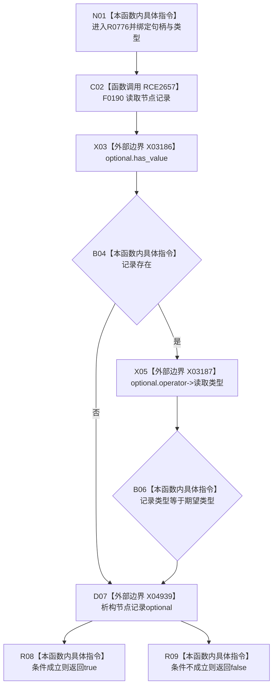

# CF-L7-0130 特征服务节点类型匹配现状流程图

图类型：现状流程图
代码版本：`03a8b7ac099ccea83e57f2696e2290b7bcdfacaf`
当前工作区复核基线：`9fda64b1f2330996913d09dd314fc498303d3e54`
源码 blob：`4c7bcd451f2e46e85d707a40c371dcbeaa2c1169`
覆盖文件：`海中鱼巣/领域/特征服务.h:1204-1207`
唯一根函数：R0776
完整签名：`bool 海中鱼巣::特征服务::节点类型匹配(节点句柄 节点句柄值, 节点类型 类型) const`
参数：待读节点句柄与期望节点类型
返回结果：节点记录存在且记录类型等于期望类型时返回 true，否则 false
调用图：`流程图/主程序可达调用关系/00_main可达函数身份表.md`、`01_main可达项目调用边表.md`、`02_main可达外部边界表.md`
已登记调用方：R0763（RCE2601）、R0561（RCE2655）、R0558（RCE2656）、R0777（RCE2660）
直接项目函数：F0190（RCE2657）
外部边界：X03186、X03187、X04939
结构读写：经 F0190 只读节点记录；不修改仓库
逐行映射表：`流程图/代码流程图/L7/CF-L7-0130_特征服务节点类型匹配_逐行代码映射表.md`
不得作为施工许可：是
不得宣称：false 能区分记录不存在与类型不匹配，或 true 已证明节点满足更高层业务合同

## 流程图

## 当前边界

- `&&` 短路保证记录不存在时不执行 X03187；X04939 在布尔结果形成后销毁局部 optional。
