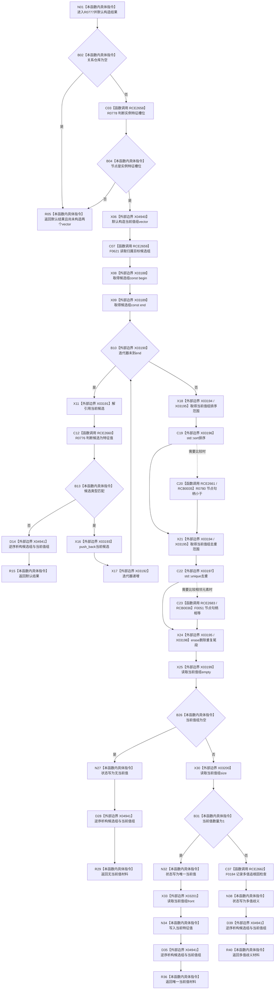

# CF-L7-0131 特征服务读取实例槽位当前值材料现状流程图

图类型：现状流程图
代码版本：`03a8b7ac099ccea83e57f2696e2290b7bcdfacaf`
当前工作区复核基线：`9fda64b1f2330996913d09dd314fc498303d3e54`
源码 blob：`4c7bcd451f2e46e85d707a40c371dcbeaa2c1169`
覆盖文件：`海中鱼巣/领域/特征服务.h:1239-1266`
唯一根函数：R0777
完整签名：`实例槽位当前值材料 海中鱼巣::特征服务::读取实例槽位当前值材料(节点句柄 槽位节点) const`
参数：待读取的槽位节点句柄
返回结果：前置或候选类型失败时返回默认材料；去重后分别返回无当前值、唯一当前值或多值歧义材料
调用图：`流程图/主程序可达调用关系/00_main可达函数身份表.md`、`01_main可达项目调用边表.md`、`02_main可达外部边界表.md`
已登记调用方：R0763（RCE2603）
直接项目函数：R0778（RCE2658）、F0621（RCE2659）、R0776（RCE2660）、R0780（RCE2661；RCB0035 sort 同步比较回调）、F0051（RCE2683；RCB0036 unique 同步相等回调）、F0184（RCE2662）
外部边界：X03188—X03201、X04940、X04941
结构读写：只读关系仓库和节点类型；排序、去重及状态写入只作用于局部材料和局部 vector，不修改仓库
逐行映射表：`流程图/代码流程图/L7/CF-L7-0131_特征服务读取实例槽位当前值材料_逐行代码映射表.md`
不得作为施工许可：是
不得宣称：默认材料能区分关系仓库为空、槽位非法或候选类型错误，或多值歧义已经被自动修复

## 流程图

## 当前边界

- 两个 vector 构造后，每个出口都按候选组、当前值组的逆序经 X04941 析构。排序与去重回调是同步且按需发生，空组或单元素时不保证调用回调函数。
