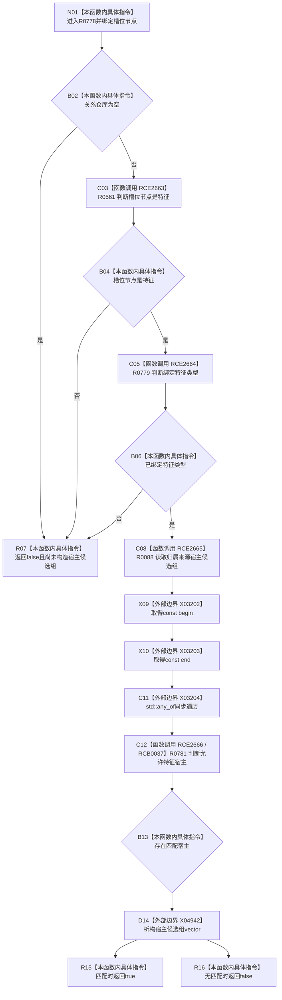

# CF-L7-0132 特征服务节点是实例特征槽位现状流程图

图类型：现状流程图
代码版本：`03a8b7ac099ccea83e57f2696e2290b7bcdfacaf`
当前工作区复核基线：`9fda64b1f2330996913d09dd314fc498303d3e54`
源码 blob：`4c7bcd451f2e46e85d707a40c371dcbeaa2c1169`
覆盖文件：`海中鱼巣/领域/特征服务.h:1268-1276`
唯一根函数：R0778
完整签名：`bool 海中鱼巣::特征服务::节点是实例特征槽位(节点句柄 槽位节点) const`
参数：待核对的槽位节点句柄
返回结果：关系仓库存在、节点为特征、绑定特征类型且至少一个归属来源是允许特征宿主时返回 true，否则 false
调用图：`流程图/主程序可达调用关系/00_main可达函数身份表.md`、`01_main可达项目调用边表.md`、`02_main可达外部边界表.md`
已登记调用方：R0763（RCE2602）、R0777（RCE2658）
直接项目函数：R0561（RCE2663）、R0779（RCE2664）、R0088（RCE2665）、R0781（RCE2666；RCB0037 同步谓词回调）
外部边界：X03202、X03203、X03204、X04942
结构读写：只读关系仓库与节点类型，不修改仓库
逐行映射表：`流程图/代码流程图/L7/CF-L7-0132_特征服务节点是实例特征槽位_逐行代码映射表.md`
不得作为施工许可：是
不得宣称：true 证明槽位只有一个宿主、只有一个特征类型或关系记录没有歧义

## 流程图

## 当前边界

- 三项前置条件按 `||` 短路；只有全部通过才构造宿主候选组。X04942 在 `any_of` 结果形成后、函数返回前执行。
