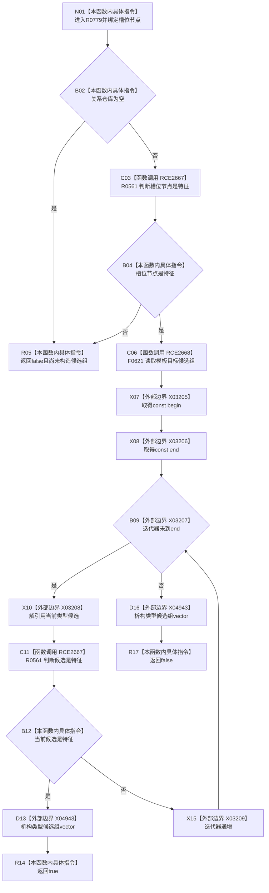

# CF-L7-0133 特征服务槽位绑定特征类型现状流程图

图类型：现状流程图
代码版本：`03a8b7ac099ccea83e57f2696e2290b7bcdfacaf`
当前工作区复核基线：`9fda64b1f2330996913d09dd314fc498303d3e54`
源码 blob：`4c7bcd451f2e46e85d707a40c371dcbeaa2c1169`
覆盖文件：`海中鱼巣/领域/特征服务.h:1278-1289`
唯一根函数：R0779
完整签名：`bool 海中鱼巣::特征服务::槽位绑定特征类型(节点句柄 槽位节点) const`
参数：待核对的槽位节点句柄
返回结果：关系仓库存在、槽位自身为特征且模板目标候选中至少一个节点为特征时返回 true，否则 false
调用图：`流程图/主程序可达调用关系/00_main可达函数身份表.md`、`01_main可达项目调用边表.md`、`02_main可达外部边界表.md`
已登记调用方：R0778（RCE2664）、R0859（RCE3165）
直接项目函数：R0561（RCE2667，两处）、F0621（RCE2668）
外部边界：X03205、X03206、X03207、X03208、X03209、X04943
结构读写：只读关系仓库模板目标组与节点类型，不修改仓库
逐行映射表：`流程图/代码流程图/L7/CF-L7-0133_特征服务槽位绑定特征类型_逐行代码映射表.md`
不得作为施工许可：是
不得宣称：true 证明绑定唯一、绑定方向完整，或模板候选关系本身有效

## 流程图

## 当前边界

- 前置短路失败时尚未构造候选组；候选组构造后，无论命中或遍历结束都先经 X04943 析构再返回。
