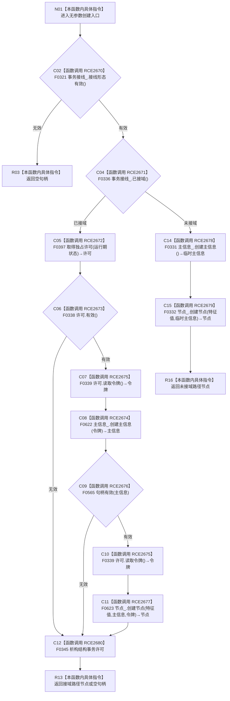

# CF-L7-0134 特征值服务创建特征值现状流程图

图类型：现状流程图
代码版本：`03a8b7ac099ccea83e57f2696e2290b7bcdfacaf`
当前工作区复核基线：`9fda64b1f2330996913d09dd314fc498303d3e54`
源码 blob：`be8c82c78253b3bc7d3f4aa15a93660e0025bb06`
覆盖文件：`海中鱼巣/领域/特征值服务.h:200-210`
唯一根函数：R0782
完整签名：`节点句柄 海中鱼巣::特征值服务::创建特征值()`
参数：无
返回结果：接线无效或接域许可无效时返回空句柄；接域路径在同一许可令牌下创建主信息和特征值节点；未接域路径经普通仓库入口创建并返回节点
已登记调用方：R0763（RCE2604）
直接项目函数：F0321、F0336、F0397、F0338、F0622、F0339、F0565、F0623、F0331、F0332、F0345（RCE2670—RCE2680）
外部边界：无
逐行映射表：`流程图/代码流程图/L7/CF-L7-0134_特征值服务创建特征值_逐行代码映射表.md`
结构读写：成功路径创建主信息和特征值节点；接域路径由结构事务许可约束，未接域路径使用普通仓库入口
不得作为施工许可：是
不得宣称：返回空句柄时普通仓库路径没有留下已创建主信息

## 流程图

## 当前边界

- 接域路径的主信息与节点创建使用同一许可令牌；F0345 覆盖许可构造后的所有正常返回路径。
- 未接域路径把主信息创建结果直接传入节点创建；本函数不在节点创建失败时撤销已创建主信息。
