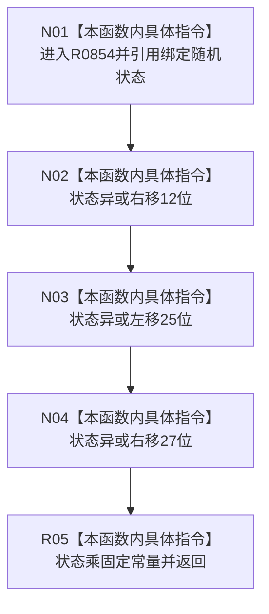

# CF-L7-0135 下一个随机数现状流程图

图类型：现状流程图
代码版本：`03a8b7ac099ccea83e57f2696e2290b7bcdfacaf`
当前工作区复核基线：`4e0ac10ae3b18404ff2b623faa0fb006fa0fc7a1`
源码 blob：`59de05d5ba3594942c819c9ec50e3d0ebc6cb9bd`
覆盖文件：`海中鱼巣/自检.入口初始化.ixx:520-525`
唯一根函数：R0854
完整签名：`std::uint64_t 海中鱼巣::运行自我场景多存在特征状态自检(const 海中鱼巣::入口初始化自检运行配置&)::<lambda@自检.入口初始化.ixx:520>::operator()() const`
参数：无显式参数；闭包按引用捕获并修改局部随机状态
返回结果：三次异或移位后的状态乘固定常量所得 uint64 值
调用图：正式 main 可达关系表
已登记调用方：R0855、R0856
直接项目函数：无
外部边界：无
逐行映射表：`流程图/代码流程图/L7/CF-L7-0135_下一个随机数_逐行代码映射表.md`
不得作为施工许可：是
不得宣称：该确定性序列具有密码学随机性或生产随机源权威性

## 流程图

## 当前边界

- 本函数仅用于隔离自检的确定性数据生成。
