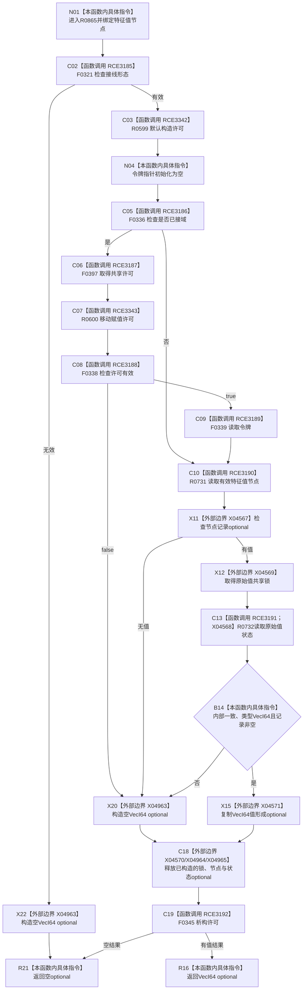

# CF-L7-0137 特征值服务读取 VecI64 值现状流程图

图类型：现状流程图
代码版本：`03a8b7ac099ccea83e57f2696e2290b7bcdfacaf`
当前工作区复核基线：`00d917a5cf09998d2ab14d9239e1c194b5593ff0`
源码 blob：`be8c82c78253b3bc7d3f4aa15a93660e0025bb06`
覆盖文件：`海中鱼巣/领域/特征值服务.h:347-367`
唯一根函数：R0865
完整签名：`std::optional<std::vector<std::int64_t>> 海中鱼巣::特征值服务::读取VecI64值(海中鱼巣::节点句柄 特征值节点) const`
参数：特征值节点按值；只读服务，必要时持有共享许可与原始值共享锁
返回结果：接线、许可、节点及 VecI64 原始状态均有效时返回向量副本，否则空 optional
调用图：正式 main 可达关系表
已登记调用方：R0861（RCE3169）
直接项目函数：F0321、F0336、F0397、F0338、F0339、R0731、R0732、F0345（RCE3185—RCE3192），R0599（RCE3342）、R0600（RCE3343）
外部边界：X04567—X04571、X04963—X04965
逐行映射表：`流程图/代码流程图/L7/CF-L7-0137_特征值服务读取VecI64值_逐行代码映射表.md`
不得作为施工许可：是
不得宣称：空 optional 可区分接线、许可、节点、类型或内部一致性失败

## 流程图

## 当前边界

- 已接域时共享许可覆盖节点与原始值读取；未接域时令牌保持空指针。
