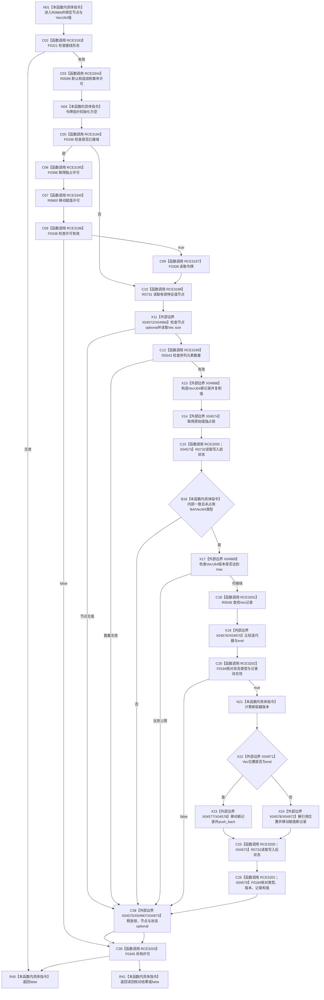

# CF-L7-0138 特征值服务写入 VecU64 值现状流程图

图类型：现状流程图
代码版本：`03a8b7ac099ccea83e57f2696e2290b7bcdfacaf`
当前工作区复核基线：`00d917a5cf09998d2ab14d9239e1c194b5593ff0`
源码 blob：`be8c82c78253b3bc7d3f4aa15a93660e0025bb06`
覆盖文件：`海中鱼巣/领域/特征值服务.h:369-424`
唯一根函数：R0866
完整签名：`bool 海中鱼巣::特征值服务::写入VecU64值(海中鱼巣::节点句柄 特征值节点, const std::vector<std::uint64_t>& 值)`
参数：特征值节点按值；VecU64 值为调用期间有效的只读借用
返回结果：接线、许可、节点、序列数量、写前状态和版本均有效，记录写入后读回完全匹配时 true；否则 false
调用图：正式 main 可达关系表
已登记调用方：R0862（RCE3171）
直接项目函数：F0321、F0336、F0398、F0338、F0339、R0731、R0543、R0732、R0546、F0184、F0345（RCE3193—RCE3203），R0599（RCE3344）、R0600（RCE3345）
外部边界：X04572—X04579、X04966—X04973
逐行映射表：`流程图/代码流程图/L7/CF-L7-0138_特征值服务写入VecU64值_逐行代码映射表.md`
不得作为施工许可：是
不得宣称：false 分支都会撤销已写入的 Vec 记录，或所有 false 都是正常入口拒绝

## 流程图

## 当前边界

- 记录写入发生在最终读回前；最终 F0184 返回 false 时，本函数不撤销刚刚写入的 Vec 记录。
- 未接域路径保持空令牌；已接域路径由独占许可和原始值独占锁覆盖后续访问。
