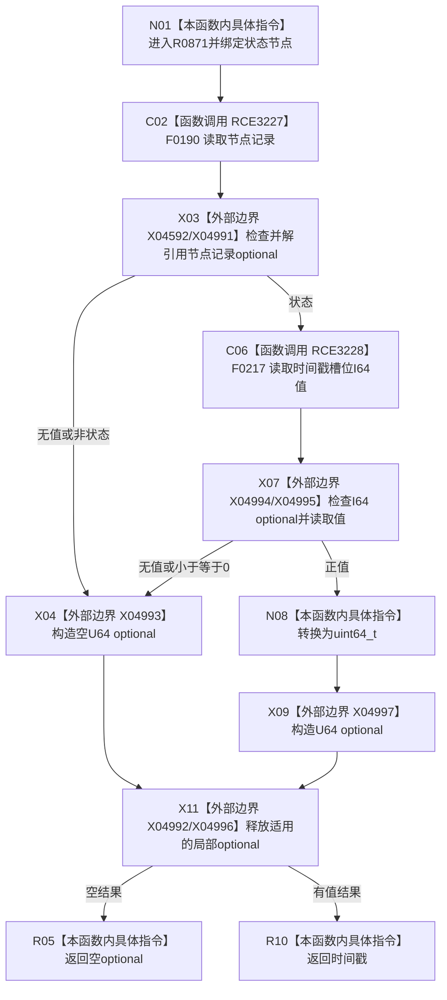

# CF-L7-0140 状态服务读取发生时间戳现状流程图

图类型：现状流程图
代码版本：`03a8b7ac099ccea83e57f2696e2290b7bcdfacaf`
当前工作区复核基线：`00d917a5cf09998d2ab14d9239e1c194b5593ff0`
源码 blob：`5b6bb9defda124496de99899621a9e4ab2dac179`
覆盖文件：`海中鱼巣/领域/状态服务.h:193-203`
唯一根函数：R0871
完整签名：`std::optional<std::uint64_t> 海中鱼巣::状态服务::读取发生时间戳(海中鱼巣::节点句柄 状态节点) const`
参数：状态节点按值；只读节点和主信息仓库
返回结果：节点为状态且时间戳槽位存在并大于零时返回 U64 时间戳，否则空 optional
调用图：正式 main 可达关系表
已登记调用方：R0870（RCE3226）、R0587（RCE3319）
直接项目函数：F0190（RCE3227）、F0217（RCE3228）
外部边界：X04592、X04991—X04997
逐行映射表：`流程图/代码流程图/L7/CF-L7-0140_状态服务读取发生时间戳_逐行代码映射表.md`
不得作为施工许可：是
不得宣称：空 optional 可区分节点无效、类型错误、槽位缺失或非正时间戳

## 流程图

## 当前边界

- 负值、零值与槽位缺失统一折叠为空 optional；转换仅在正值分支执行。
