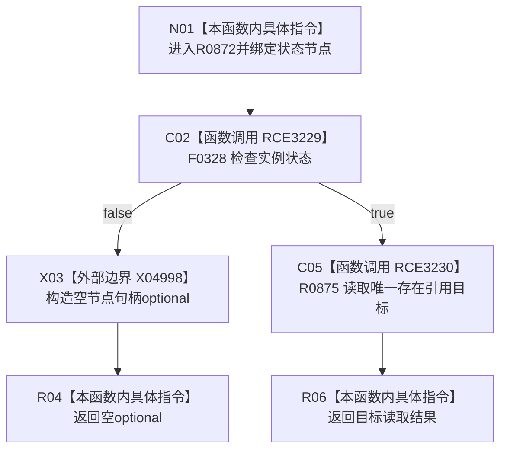

# CF-L7-0141 状态服务读取状态主体现状流程图

图类型：现状流程图
代码版本：`03a8b7ac099ccea83e57f2696e2290b7bcdfacaf`
当前工作区复核基线：`00d917a5cf09998d2ab14d9239e1c194b5593ff0`
源码 blob：`5b6bb9defda124496de99899621a9e4ab2dac179`
覆盖文件：`海中鱼巣/领域/状态服务.h:211-216`
唯一根函数：R0872
完整签名：`std::optional<海中鱼巣::节点句柄> 海中鱼巣::状态服务::读取状态主体(海中鱼巣::节点句柄 状态节点) const`
参数：状态节点按值
返回结果：非实例状态返回空 optional；实例状态返回唯一存在类型引用目标的读取结果
调用图：正式 main 可达关系表
已登记调用方：R0870（RCE3223）
直接项目函数：F0328（RCE3229）、R0875（RCE3230）
外部边界：X04998
逐行映射表：`流程图/代码流程图/L7/CF-L7-0141_状态服务读取状态主体_逐行代码映射表.md`
不得作为施工许可：是
不得宣称：空 optional 可区分非实例状态、无存在引用或重复存在引用

## 流程图

## 当前边界

- 引用目标唯一性和类型筛选完全由 R0875 承担。
