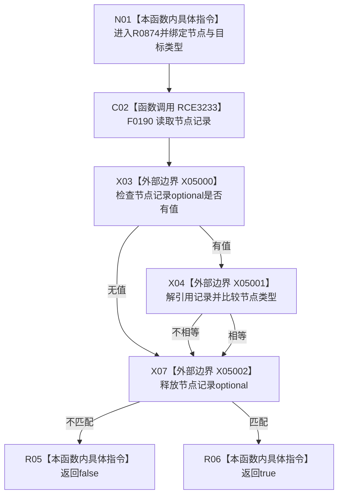

# CF-L7-0143 状态服务节点类型匹配现状流程图

图类型：现状流程图
代码版本：`03a8b7ac099ccea83e57f2696e2290b7bcdfacaf`
当前工作区复核基线：`00d917a5cf09998d2ab14d9239e1c194b5593ff0`
源码 blob：`5b6bb9defda124496de99899621a9e4ab2dac179`
覆盖文件：`海中鱼巣/领域/状态服务.h:312-315`
唯一根函数：R0874
完整签名：`bool 海中鱼巣::状态服务::节点类型匹配(海中鱼巣::节点句柄 节点句柄值, 海中鱼巣::节点类型 类型) const`
参数：节点句柄与目标节点类型均按值
返回结果：节点记录存在且记录类型等于目标类型时 true，否则 false
调用图：正式 main 可达关系表
已登记调用方：R0868（RCE3212）、R0869（RCE3214）、R0875（RCE3235）
直接项目函数：F0190（RCE3233）
外部边界：X05000—X05002
逐行映射表：`流程图/代码流程图/L7/CF-L7-0143_状态服务节点类型匹配_逐行代码映射表.md`
不得作为施工许可：是
不得宣称：false 可区分节点不存在与类型不匹配

## 流程图

## 当前边界

- 本函数只读节点记录；不存在与类型不匹配统一返回 false。
