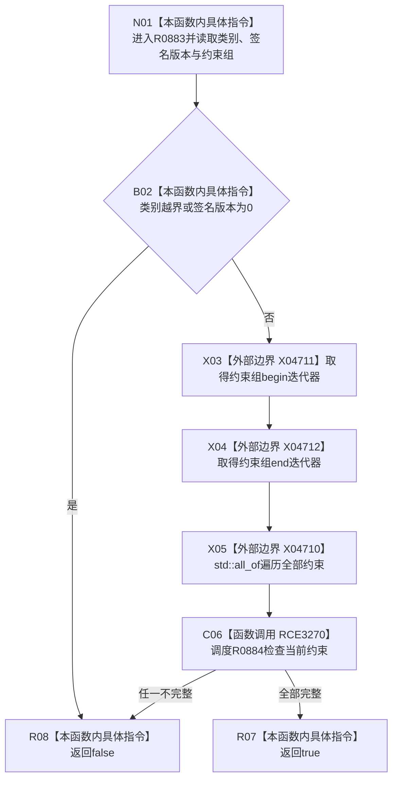

# CF-L7-0144 概念签名材料完整现状流程图

图类型：现状流程图
代码版本：`03a8b7ac099ccea83e57f2696e2290b7bcdfacaf`
当前工作区复核基线：`00d917a5cf09998d2ab14d9239e1c194b5593ff0`
源码 blob：`31c9794099a8fc191c3d5d9369010c52cd863039`
覆盖文件：`海中鱼巣/领域/概念图算法.h:89-96`
唯一根函数：R0883
完整签名：`bool 海中鱼巣::概念签名材料::完整() const`
参数：无显式参数；只读当前概念签名材料
返回结果：类别在存在至因果范围内、签名版本非零且全部约束完整时返回 true，否则 false
调用图：正式 main 可达关系表
已登记调用方：R0532（RCE3264）
直接项目函数：R0884（RCE3270，经 `std::all_of`）
外部边界：X04710、X04711、X04712
逐行映射表：`流程图/代码流程图/L7/CF-L7-0144_概念签名材料完整_逐行代码映射表.md`
不得作为施工许可：是
不得宣称：true 证明签名与某个概念根相同或已经登记

## 流程图

## 当前边界

- 空约束组满足 `std::all_of`，本函数不要求至少存在一项约束。
