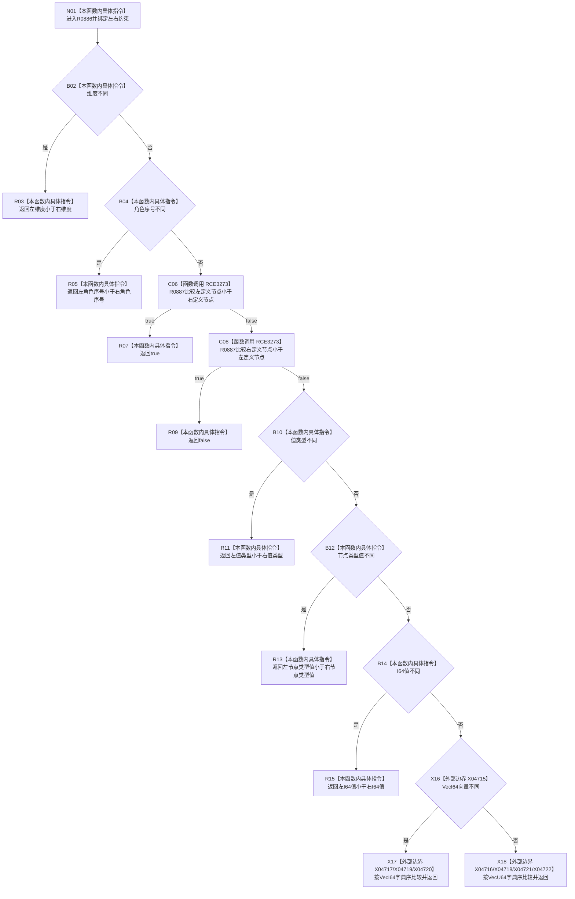

# CF-L7-0145 概念约束小于现状流程图

图类型：现状流程图
代码版本：`03a8b7ac099ccea83e57f2696e2290b7bcdfacaf`
当前工作区复核基线：`00d917a5cf09998d2ab14d9239e1c194b5593ff0`
源码 blob：`31c9794099a8fc191c3d5d9369010c52cd863039`
覆盖文件：`海中鱼巣/领域/概念图算法.h:640-668`
唯一根函数：R0886
完整签名：`static bool 海中鱼巣::概念图算法::约束小于(const 海中鱼巣::概念约束材料& 左, const 海中鱼巣::概念约束材料& 右)`
参数：`左`、`右` 均为调用期间有效的只读概念约束材料借用
返回结果：按维度、角色序号、定义节点、值类型、节点类型值、I64、VecI64、VecU64 顺序形成严格小于结果
调用图：正式 main 可达关系表
已登记调用方：R0532（RCE3265，经 `std::sort`）、R0537（RCE3267，经 `std::includes`）
直接项目函数：R0887（RCE3273）
外部边界：X04715、X04716、X04717、X04718、X04719、X04720、X04721、X04722
逐行映射表：`流程图/代码流程图/L7/CF-L7-0145_概念约束小于_逐行代码映射表.md`
不得作为施工许可：是
不得宣称：false 证明左右约束相等；false 也可能表示左大于右

## 流程图

## 当前边界

- 本函数实现严格排序谓词；定义节点等价需双向调用 R0887 均返回 false 后才继续比较其它字段。
