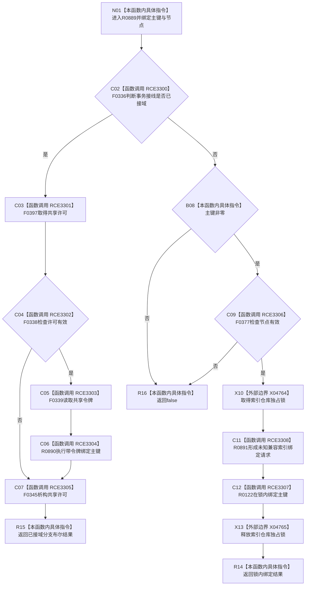

# CF-L7-0146 索引仓库绑定主键无令牌重载现状流程图

图类型：现状流程图
代码版本：`03a8b7ac099ccea83e57f2696e2290b7bcdfacaf`
当前工作区复核基线：`00d917a5cf09998d2ab14d9239e1c194b5593ff0`
源码 blob：`8874312f67f19b220a08b1397c6103396878513d`
覆盖文件：`海中鱼巣/核心/索引仓库.cpp:102-111`
唯一根函数：R0889
完整签名：`bool 海中鱼巣::索引仓库::绑定主键(std::uint64_t 主键, 节点句柄 节点)`
参数：`主键`、`节点` 均按值输入
返回结果：接域时返回带共享令牌重载结果；未接域时入口有效并在仓库锁下绑定成功返回 true，否则 false
调用图：正式 main 可达关系表
已登记调用方：R0573（RCE3283）
直接项目函数：F0336（RCE3300）、F0397（RCE3301）、F0338（RCE3302）、F0339（RCE3303）、R0890（RCE3304）、F0345（RCE3305）、F0377（RCE3306）、R0122（RCE3307）、R0891（RCE3308）
外部边界：X04764、X04765
逐行映射表：`流程图/代码流程图/L7/CF-L7-0146_索引仓库绑定主键无令牌重载_逐行代码映射表.md`
不得作为施工许可：是
不得宣称：true 证明主键所有权已由具名领域所有者声明

## 流程图

## 当前边界

- 未接域重载在写锁前拒绝零主键和无效节点；实际所有权口径由 R0891 形成的未知兼容请求承载。
