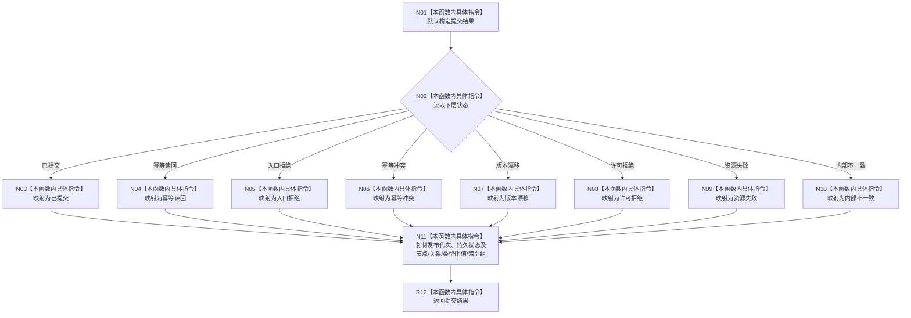

# CF-L7-0167 映射结果现状流程图

图类型：现状流程图
代码版本：`4b80f1617dd70ec7a19e1a34efa9da768dce8927`
源码 blob：`81436fae9c0952071918e5353ece369150ec1fef`
覆盖文件：`海中鱼巣/核心/服务.节点直接类型化结构提交.ixx:69-89`
唯一根函数：R1092
完整签名：`节点直接类型化结构提交结果 海中鱼巣::节点直接类型化结构提交服务::映射结果_(const 节点直接类型化结构数据操作结果& 下层)`
参数：下层结果为调用期只读借用
返回结果：按值返回提交层结果，状态和六组发布/读回字段从下层复制
调用图：R1091 -> R1092；本函数无直接项目函数调用
逐行映射表：`流程图/代码流程图/L7/CF-L7-0167_映射结果_逐行代码映射表.md`
输入契约 / 调用语境表：R1091 以 R1054 的结构化下层结果调用
非成功返回二分审查表：入口拒绝、幂等冲突、版本漂移、许可拒绝、资源失败与内部不一致保持同类状态，不转写为成功
偏差清单：无
依据提交 / 结构化消息：`4b80f161`
验证输出：本批仅文档机械验证
不得作为施工许可：是
不得宣称：状态映射代表下层事务、持久见证或业务验收成功

## 流程图

## 当前边界

- 本函数不重新解释下层状态，也不验证下层返回组之间的一致性。
