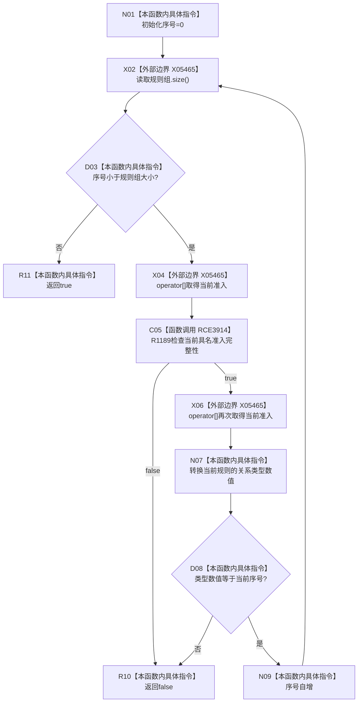

# CF-L7-0184 完整正式关系准入表完整谓词现状流程图

图类型：现状流程图
代码版本：`4b80f1617dd70ec7a19e1a34efa9da768dce8927`
源码 blob：`89248cb1a21b2d49b000f92400990bb2c36ea6bc`
覆盖文件：`海中鱼巣/核心/仓库.正式关系.ixx:97-105`
唯一根函数：R1190
完整签名：`bool 海中鱼巣::完整正式关系准入表::完整() const`
参数：无显式参数；只读遍历当前准入表的规则组
返回结果：每个槽位的具名准入完整且其关系类型数值等于槽位序号时返回 true，否则在首个不满足项返回 false
调用图：R1201（RCE3915）-> R1190 -> R1189（RCE3914）；外部边界 X05465 覆盖 `std::array::size()` 与两次 `operator[]`，位置为 98—100 行
逐行映射表：`流程图/代码流程图/L7/CF-L7-0184_完整_逐行代码映射表.md`
输入契约 / 调用语境表：R1201 检查正式关系仓库有效性时调用
非成功返回二分审查表：false 是完整性谓词结果，不改变准入表和仓库结构
偏差清单：无
依据提交 / 结构化消息：`4b80f161`；正式身份 R1190、边 RCE3914/RCE3915、稳定边界 X05465
验证输出：本批仅源码、关系表、Mermaid 和逐行覆盖机械验证
不得作为施工许可：是
不得宣称：true 代表准入表中的裁决函数对任何具体关系返回允许

## 流程图

## 当前边界

- 本函数逐项检查完整性和 ABI 槽位对应关系；不执行准入裁决函数。
