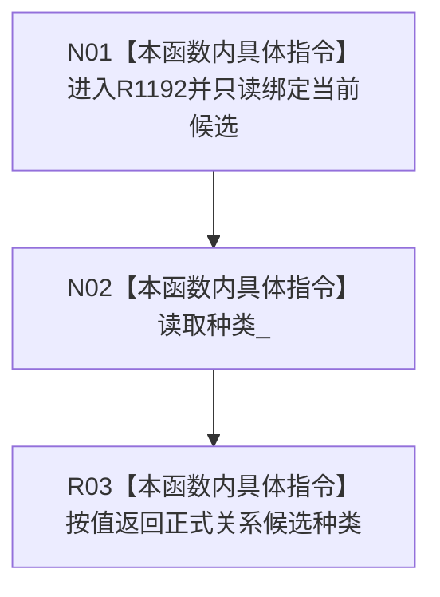

# CF-L7-0185 读取正式关系候选种类现状流程图

图类型：现状流程图
代码版本：`4b80f1617dd70ec7a19e1a34efa9da768dce8927`
源码 blob：`89248cb1a21b2d49b000f92400990bb2c36ea6bc`
覆盖文件：`海中鱼巣/核心/仓库.正式关系.ixx:139`
唯一根函数：R1192
完整签名：`正式关系候选种类 海中鱼巣::正式关系候选::读取种类() const`
参数：无显式参数；只读访问当前正式关系候选
返回结果：按值返回候选的 `种类_`
调用图：R1265（RCE3917）-> R1192；本函数无直接项目函数调用和外部边界
逐行映射表：`流程图/代码流程图/L7/CF-L7-0185_读取种类_逐行代码映射表.md`
输入契约 / 调用语境表：写入会话登记关系候选时读取候选种类
非成功返回二分审查表：无判断和非成功分支
偏差清单：无
依据提交 / 结构化消息：`466d1ab0`；正式身份 R1192 与边 RCE3917
验证输出：本批仅源码、关系表、Mermaid 和逐行覆盖机械验证
不得作为施工许可：是
不得宣称：读取到候选种类代表候选当前阶段允许确认或发布

## 流程图

## 当前边界

- 本访问器不读取候选阶段，也不改变候选内容。
