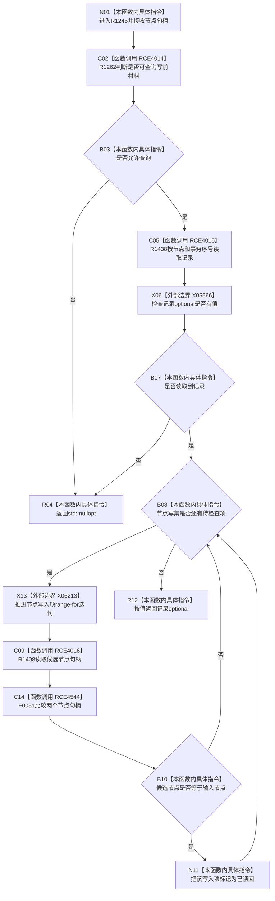

# CF-L7-0194 `节点直接身份结构写入会话::读取节点` 现状流程图

图类型：现状流程图
代码版本：`4b80f1617dd70ec7a19e1a34efa9da768dce8927`
源码 blob：`ca407389bb111031643ec2d9fa41157166775db6`
覆盖文件：`海中鱼巣/核心/会话.节点直接身份结构写入.ixx:131-139`
唯一根函数：R1245
完整签名：`std::optional<节点直接身份记录> 海中鱼巣::节点直接身份结构写入会话::读取节点(节点句柄 节点)`
参数：`节点` 按值输入；借用当前写入会话
返回结果：允许查询写前材料且节点仓在当前事务中返回记录时，标记写集中同句柄候选为已读回并返回记录；否则返回空 optional
已登记调用方：R1129（RCE3698）、R1130（RCE3700）、R1136（RCE3742）、R1137（RCE3754）、R1142（RCE3782）、R1146（RCE3790）、R1251（RCE4017）
直接项目函数：R1262（RCE4014）、R1438（RCE4015）、R1408（原地纠正后的 RCE4016）、F0051（RCE4544）
外部边界：X05566 `std::optional<T>::has_value()`、X06213 `std::vector<节点写入项>` range-for 聚合边界
逐行映射表：`流程图/代码流程图/L7/CF-L7-0194_读取节点_逐行代码映射表.md`
非成功口径：入口不可查询或节点仓不命中均返回空 optional；空值不区分原因
不得作为施工许可：是
不得宣称：返回记录已最终发布、空 optional 证明节点从未存在，或已读回标记会改变节点仓记录

## 流程图

## 当前边界

- RCE4016 在本批共享表收口时原地纠正为 R1245→R1408；句柄比较另由 RCE4544 指向 F0051。
- 遍历会标记所有句柄相等的写集项，不在首次命中后提前退出。
