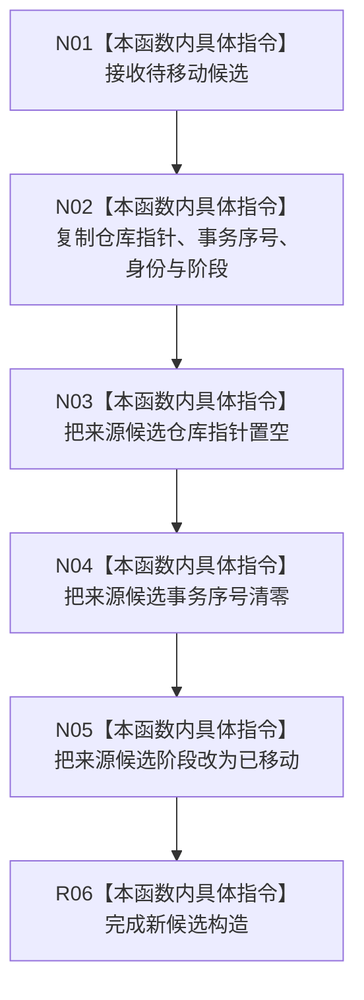

# CF-L7-0201 节点直接事务幂等候选移动构造现状流程图

图类型：现状流程图
代码版本：`4b80f1617dd70ec7a19e1a34efa9da768dce8927`
源码 blob：`51f626fd79eb63dba5b57bf329ef3aae0a59abbc`
覆盖文件：`海中鱼巣/核心/仓库.节点直接事务幂等.ixx:22-27`
唯一根函数：R1311
完整签名：`海中鱼巣::节点直接事务幂等候选::节点直接事务幂等候选(节点直接事务幂等候选&& 其它) noexcept`
参数：其它为右值引用；其仓库指针、事务序号、身份和阶段被复制到新候选，随后来源候选失效
返回结果：构造函数，无独立返回值；形成接管原候选状态的新对象
调用图：R1329 经 RCE4492 调用 R1311；本函数无直接项目函数调用
逐行映射表：`流程图/代码流程图/L7/CF-L7-0201_节点直接事务幂等候选_逐行代码映射表.md`
输入契约 / 调用语境表：R1329 构造 optional 候选时发生移动构造
非成功返回二分审查表：无显式失败返回
偏差清单：RCE4290 误连 R1312 的伪边已删除；R1329→R1311 的真实移动构造入边已登记为 RCE4492
依据提交 / 结构化消息：`4b80f161`
验证输出：本批仅文档机械验证
不得作为施工许可：是
不得宣称：移动构造代表候选已经确认、发布或持久化

## 流程图

## 当前边界

- 本函数只转移候选对象的本地持有状态，不读取或写入仓库记录。
