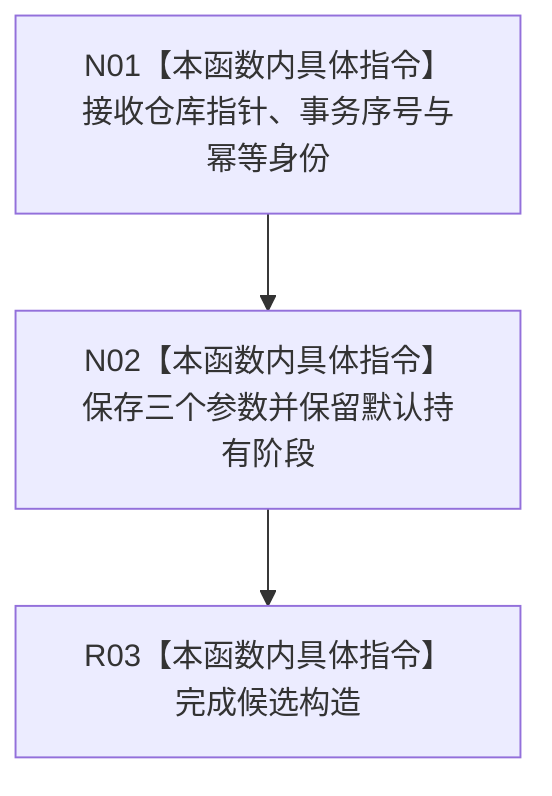

# CF-L7-0202 节点直接事务幂等候选私有构造现状流程图

图类型：现状流程图
代码版本：`4b80f1617dd70ec7a19e1a34efa9da768dce8927`
源码 blob：`51f626fd79eb63dba5b57bf329ef3aae0a59abbc`
覆盖文件：`海中鱼巣/核心/仓库.节点直接事务幂等.ixx:35-39`
唯一根函数：R1312
完整签名：`海中鱼巣::节点直接事务幂等候选::节点直接事务幂等候选(节点直接事务幂等仓库* 仓库, std::uint64_t 事务序号, 节点直接事务幂等身份 身份) noexcept`
参数：仓库为非拥有指针；事务序号和身份按值保存
返回结果：构造函数，无独立返回值；形成默认处于持有阶段的候选
调用图：R1329 -> R1312；本函数无直接项目函数调用
逐行映射表：`流程图/代码流程图/L7/CF-L7-0202_节点直接事务幂等候选_逐行代码映射表.md`
输入契约 / 调用语境表：R1329 在仓库记录候选落位后构造候选对象
非成功返回二分审查表：无显式失败返回
偏差清单：无；R1311 不应作为本函数调用方
依据提交 / 结构化消息：`4b80f161`
验证输出：本批仅文档机械验证
不得作为施工许可：是
不得宣称：对象构造代表候选已确认或发布

## 流程图

## 当前边界

- 本函数不验证指针、事务序号或身份，也不直接改变仓库记录。
