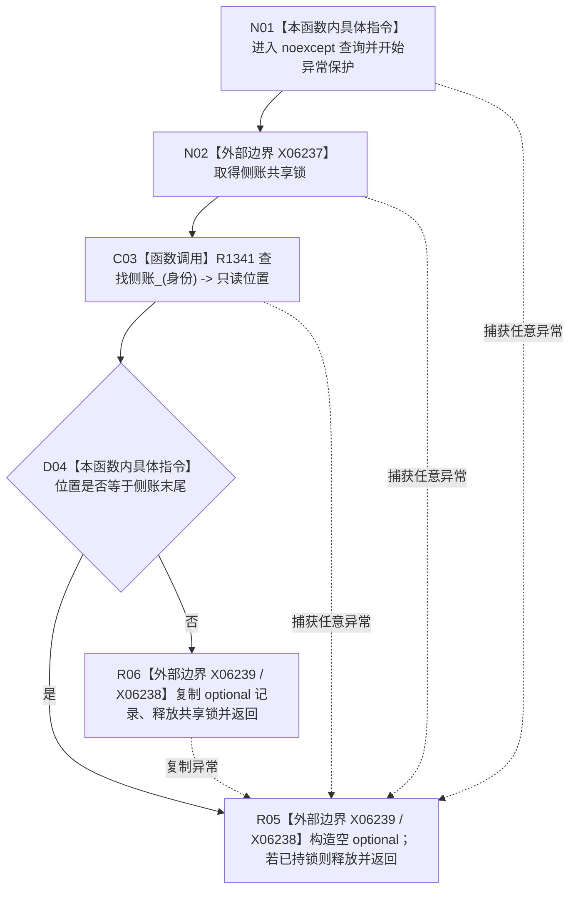

# CF-L7-0203 读取持久证据侧账现状流程图

图类型：现状流程图
代码版本：`4b80f1617dd70ec7a19e1a34efa9da768dce8927`
源码 blob：`51f626fd79eb63dba5b57bf329ef3aae0a59abbc`
覆盖文件：`海中鱼巣/核心/仓库.节点直接事务幂等.ixx:92-102`
唯一根函数：R1316
完整签名：`std::optional<节点直接持久证据侧账记录> 海中鱼巣::节点直接事务幂等仓库::读取持久证据侧账(节点直接事务幂等身份 身份) const noexcept`
参数：身份按值；函数只读借用当前仓库
返回结果：命中侧账时返回记录副本；未命中或捕获任意异常时返回 `std::nullopt`
调用图：R1317/R1320 -> R1316；R1316 -> R1341（只读查找侧账）
逐行映射表：`流程图/代码流程图/L7/CF-L7-0203_读取持久证据侧账_逐行代码映射表.md`
输入契约 / 调用语境表：R1317 读取状态；R1320 读取尝试序号后转调三参数状态记录重载
非成功返回二分审查表：侧账不存在为只读空结果；锁或复制异常被压缩为空结果，调用方无法区分
偏差清单：RCE4294 调用点应精确到第 96 行
依据提交 / 结构化消息：`4b80f161`
验证输出：本批仅文档机械验证
不得作为施工许可：是
不得宣称：空结果必然表示侧账不存在，异常路径也返回空结果

## 流程图

## 当前边界

- 本函数不校验身份完整性；所有异常均被压缩为与未命中相同的空结果。
