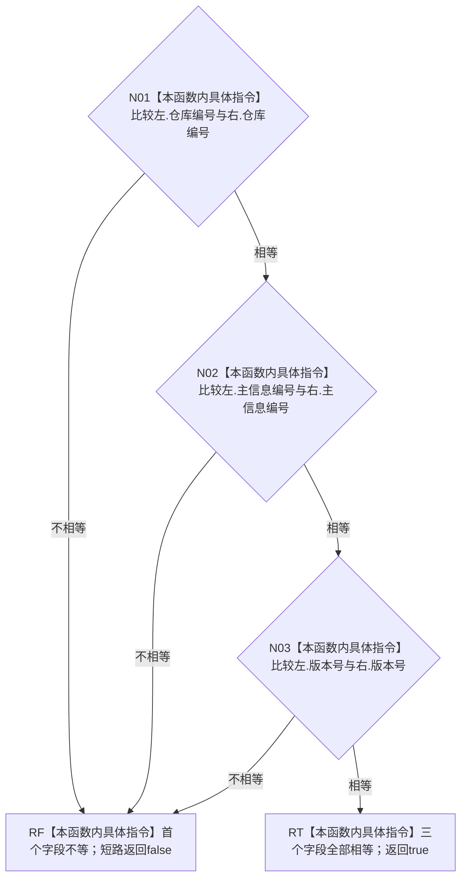

# CF-L8-0001 `主信息句柄 operator==` 现状流程图

图类型：现状流程图
代码版本：`747223647b2cc5796db66a048009d78fa4d96ed7`
源码 blob：`5e48828f7fca6cb83a314852fed9a8c84d9fdd98`
覆盖文件：`海中鱼巣/核心/句柄.h:143-145`
唯一根函数：R0615
完整签名：`bool 海中鱼巣::operator==(const 海中鱼巣::主信息句柄& 左, const 海中鱼巣::主信息句柄& 右)`
参数：`左`、`右` 均为调用期间有效的 `主信息句柄` 只读借用，不转移所有权
返回结果：依次比较仓库编号、主信息编号、版本号；任一字段不同返回 `false`，三字段全部相等返回 `true`
非法值 / 拒绝：无；零值和其它无效句柄仍可按三字段比较
已登记调用方：R0613 经 RCE1767 在 `系统角色清单.数据.h:122` 比较 `主信息` 成员
直接项目函数：无
外部边界：无；三个无符号整数相等比较均为内建指令
未解析项目调用：无
调用图：`流程图/主程序可达调用关系/01_main可达项目调用边表.md`
外部边界表：`流程图/主程序可达调用关系/02_main可达外部边界表.md`
逐行映射表：`流程图/代码流程图/L8/CF-L8-0001_主信息句柄相等运算符_逐行代码映射表.md`
输入契约 / 调用语境表：本文“调用语境与结果分账”
非成功返回二分审查表：本文“调用语境与结果分账”
偏差清单：本文“当前边界与规范核对”
依据提交 / 结构化消息：冻结提交 `747223647b2cc5796db66a048009d78fa4d96ed7`；目标源码 blob 与该提交一致
结构读取与写入：只读两个句柄的三个直接字段；不读取或写入主信息仓库
逻辑内返回：`false` 是值对象不等结果
内部错误：无结构化错误或异常分支
生命周期与资源释放：不加锁、不分配资源、不保留借用
异常：声明未写 `noexcept`，但当前函数体仅执行内建整数比较与布尔返回
并发 / 幂等：纯只读值比较
验证入口：`核心/句柄.h:143-145`、RCE1767
验证输出：3 个源码行完整映射到 5 个流程节点；1 个项目入边、0 个项目出边、0 个外部边界、0 个未解析调用；本批不运行构建或程序
依据：`规范/0050_项目通用机器逻辑与禁止性规则总纲_20260721.md`、`规范/0600_代码函数流程图应用与维护规范.md`、`规范/4010_子规范_统一仓库稳定句柄与通用关系索引边界.md`
不得作为施工许可：是
不得宣称：句柄字段相等就证明句柄有效、对应主信息仍存在、版本是最新、仓库读取成功，或旧主信息身份路径符合当前目标合同

## 流程图

## 节点合同

| 节点 | 类型 | 参数 / 输入绑定 | 结果 / 输出绑定 | 事实读写 | 后继条件 | 稳定边 |
| --- | --- | --- | --- | --- | --- | --- |
| N01 | 本函数内具体指令 | `左.仓库编号`、`右.仓库编号` | 内建整数相等布尔值 | 只读字段 | 不等到 RF；相等到 N02 | 不适用 |
| N02 | 本函数内具体指令 | `左.主信息编号`、`右.主信息编号` | 内建整数相等布尔值 | 只读字段 | 不等到 RF；相等到 N03 | 不适用 |
| N03 | 本函数内具体指令 | `左.版本号`、`右.版本号` | 内建整数相等布尔值 | 只读字段 | 不等到 RF；相等到 RT | 不适用 |
| RF / RT | 本函数内具体指令 | 首个不等或全部相等 | `false` / `true` | 无 | 函数返回 | 不适用 |

## 已登记调用方

| 调用边 | 调用方 / 位置 | 当前实参绑定 | 结果用途 |
| --- | --- | --- | --- |
| RCE1767 | R0613 `系统角色身份材料::operator==(...) const` / `系统角色清单.数据.h:122` | 两侧身份材料的 `主信息` 成员分别绑定 `左`、`右` | 主信息句柄不等使 R0613 短路返回 false |

## 调用语境与结果分账

| 语境 | 当前输入 | 当前结果 | 非成功口径 | 结构后果 |
| --- | --- | --- | --- | --- |
| R0613 defaulted 身份材料比较 | 两侧身份材料中的主信息句柄 | 首个字段不等返回 `false`；全部相等返回 `true` | 正常值比较结果 | 无结构变化 |
| 两侧句柄均无效但三字段相同 | 两个相同零值或其它无效句柄 | 返回 `true` | 值相等，不是有效性证明 | 无结构变化 |

## 当前边界与规范核对

- R0615 仅比较三个句柄字段，不调用 `句柄有效`，也不读取主信息仓库。
- 函数仍是 R0613 当前 defaulted 身份材料比较的直接依赖；本图记录旧主信息句柄路径，不把它写成节点直接身份目标。
- 返回值只能用于值式等同判断，不能证明对象存在、版本有效或权威事实一致。
