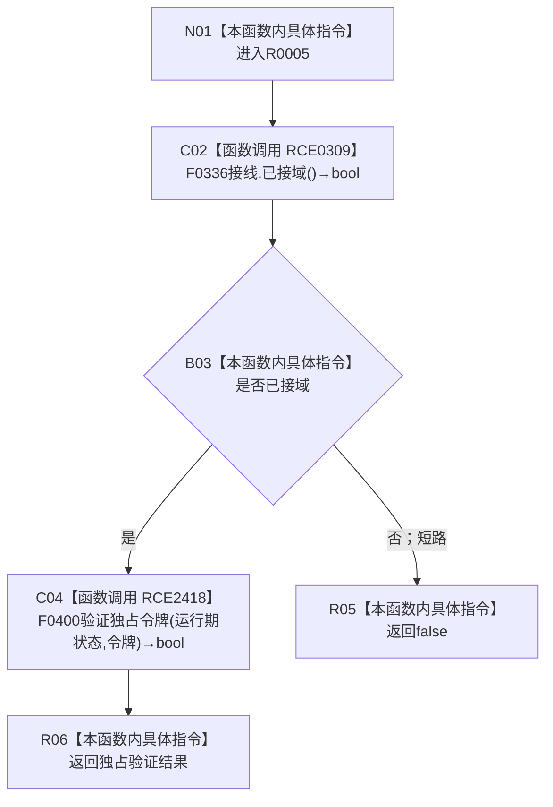

# CF-L8-0003 主信息仓库验证独占令牌现状流程图

图类型：现状流程图
代码版本：`3920a74638264f9f539d50f32f3c9fe5fb1982ab`
源码 blob：`11f8fa53ff961a8cbaac34cf75b69a22533ca907`
覆盖文件：`海中鱼巣/核心/主信息仓库.cpp:15-17`
唯一根函数：R0005
完整签名：`bool 海中鱼巣::{匿名命名空间@主信息仓库.cpp}::验证独占令牌(const 结构事务接线& 接线, const 结构事务令牌& 令牌)`
参数：接线、令牌均为 const 非拥有借用
返回结果：已接域且当前独占令牌验证目标返回真时为 `true`
已登记调用方：R0003、R0006、R0008、R0011
直接项目函数：RCE0309→F0336；RCE2418→F0400
外部边界：无；未解析项目调用：0
调用图：`流程图/主程序可达调用关系/01_main可达项目调用边表.md`
逐行映射表：`流程图/代码流程图/L8/CF-L8-0003_主信息仓库验证独占令牌_逐行代码映射表.md`
偏差清单：无；已补当前接线唯一目标 RCE2418
依据提交 / 结构化消息：当前源码、RCE0309、RCE2418
结构读取与写入：只读接线和令牌
逻辑内返回：未接域或验证不通过返回 `false`
验证输出：15—17 行完整映射
不得作为施工许可：是
不得宣称：验证通过等于取得新许可

## 流程图

## 当前边界

- RCE2418 是当前生产接线唯一解析的函数指针目标。
