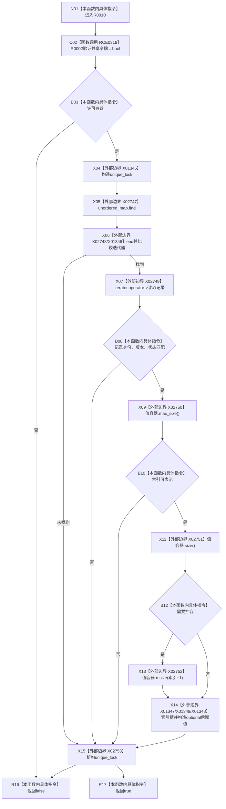

# CF-L8-0004 主信息仓库写入I64值带令牌重载现状流程图

图类型：现状流程图
代码版本：`3920a74638264f9f539d50f32f3c9fe5fb1982ab`
源码 blob：`11f8fa53ff961a8cbaac34cf75b69a22533ca907`
覆盖文件：`海中鱼巣/核心/主信息仓库.cpp:408-420`
唯一根函数：R0010
完整签名：`bool 海中鱼巣::主信息仓库::写入I64值(主信息句柄 主信息, std::uint64_t 值索引, std::int64_t 值, const 结构事务令牌& 令牌)`
参数：句柄、索引、值按值；令牌与 `this` 为借用
返回结果：许可、记录与索引有效并写入时返回 `true`
已登记调用方：F0627、F0628、R0028
直接项目函数：RCE0318→R0002
外部边界：X01345—X01349、X02747—X02753；未解析项目调用：0
调用图：`流程图/主程序可达调用关系/01_main可达项目调用边表.md`
逐行映射表：`流程图/代码流程图/L8/CF-L8-0004_主信息仓库写入I64值带令牌重载_逐行代码映射表.md`
偏差清单：无；值容器固定为 `vector<optional<int64_t>>`
依据提交 / 结构化消息：当前源码、RCE0318、上述 X 边界
结构读取与写入：按需扩容值容器并写目标 optional 槽
逻辑内返回：许可、记录或索引不合法返回 `false`
验证输出：408—420 行完整映射
不得作为施工许可：是
不得宣称：成功写入改变主信息版本

## 流程图

## 当前边界

- X01346 是 `unordered_map` 迭代器比较，不使用容器内部链表迭代器签名。
