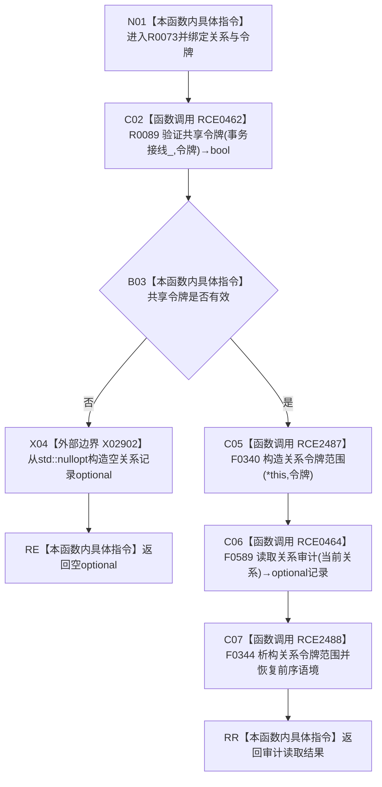

# CF-L8-0005 关系仓库读取关系审计令牌重载现状流程图

图类型：现状流程图
代码版本：`176b674a6c1499ccdd7306f30f910fec6dc5079c`
源码事实提交：`3920a74638264f9f539d50f32f3c9fe5fb1982ab`
源码 blob：`f7a9ea9a09d3065468208c16f9ea34f806b6e183`
覆盖文件：`海中鱼巣/核心/关系仓库.cpp:1434-1437`
唯一根函数：R0073
完整签名：`std::optional<海中鱼巣::关系记录> 海中鱼巣::关系仓库::读取关系审计(海中鱼巣::关系句柄 当前关系, const 海中鱼巣::结构事务令牌& 令牌) const`
参数：关系句柄按值传入；令牌为 const 非拥有借用；隐式 `this` 为 const 仓库借用
返回结果：共享令牌无效时返回空 optional；有效时建立关系令牌语境并原样返回无令牌审计重载结果
已登记调用方：R0025/R0331，经 RCE0348/RCE1058
直接项目函数：RCE0462→R0089、RCE2487→F0340、RCE0464→F0589、RCE2488→F0344
外部边界：X02902
未解析项目调用：0
逐行映射表：`流程图/代码流程图/L8/CF-L8-0005_关系仓库读取关系审计令牌重载_逐行代码映射表.md`
结构读取与写入：只建立线程局部令牌语境并读取审计投影，零持久结构变化
验证输出：1434—1437 行完整映射；2 条项目入边、4 条项目出边、1 个外部边界
不得作为施工许可：是

## 流程图

## 当前边界

- RCE2487 只在 RCE0462 返回 true 时构造令牌范围；RCE2488 覆盖构造后的正常返回与异常展开。
- X02902 直接构造返回对象，本函数内不析构该返回对象。
- F0344 只恢复线程局部关系令牌语境，不释放事务许可、不提交结构。
