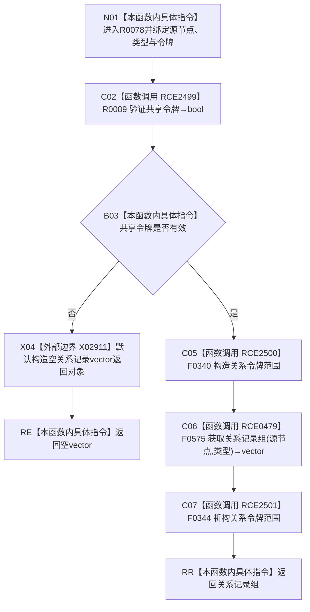

# CF-L8-0006 关系仓库获取关系记录组令牌重载现状流程图

图类型：现状流程图
代码版本：`176b674a6c1499ccdd7306f30f910fec6dc5079c`
源码事实提交：`3920a74638264f9f539d50f32f3c9fe5fb1982ab`
源码 blob：`f7a9ea9a09d3065468208c16f9ea34f806b6e183`
覆盖文件：`海中鱼巣/核心/关系仓库.cpp:1546-1549`
唯一根函数：R0078
完整签名：`std::vector<海中鱼巣::关系记录> 海中鱼巣::关系仓库::获取关系记录组(海中鱼巣::节点句柄 源节点, 海中鱼巣::关系类型 类型, const 海中鱼巣::结构事务令牌& 令牌) const`
参数：源节点和类型按值传入；令牌与 const 仓库对象为非拥有借用
返回结果：共享令牌无效时返回空向量；有效时原样返回无令牌记录组重载结果
已登记调用方：R0034/R0331/R0348/R0349/R0350/R0351/R0396/R0420/R0440/R0441/R0442/R0444/R0448/R0450/R0583/R0587/R0630/R0649/R0669/R0670/R0705，经 RCE0371/RCE1057/RCE1097/RCE1104/RCE1114/RCE1120/RCE1251/RCE1306/RCE1355/RCE1361/RCE1366/RCE1373/RCE1385/RCE1391/RCE1611/RCE1616/RCE1809/RCE1904/RCE2000/RCE2008/RCE2109
直接项目函数：RCE2499→R0089、RCE2500→F0340、RCE0479→F0575、RCE2501→F0344
外部边界：X02911
未解析项目调用：0
逐行映射表：`流程图/代码流程图/L8/CF-L8-0006_关系仓库获取关系记录组令牌重载_逐行代码映射表.md`
结构读取与写入：只建立线程局部令牌语境并读取关系记录投影，零持久结构变化
验证输出：1546—1549 行完整映射；21 条项目入边、4 条项目出边、1 个外部边界
不得作为施工许可：是

## 流程图

## 当前边界

- X02911 只在共享令牌验证失败时直接构造空返回向量。
- RCE2501 清理 RCE2500 建立的线程局部令牌语境；空向量不能区分令牌拒绝与合法无记录。
