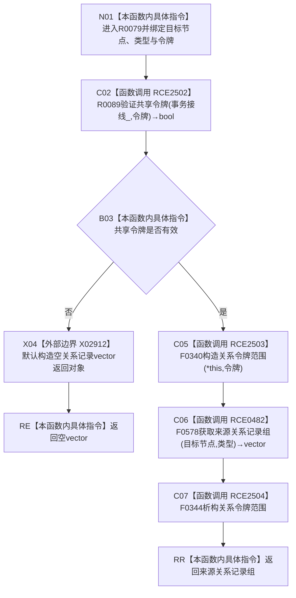

# CF-L8-0007 关系仓库获取来源关系记录组令牌重载现状流程图

图类型：现状流程图
代码版本：`7ad8cf5113162fe92b9f8d43f2b5b9f00d292d1a`
源码事实提交：`3920a74638264f9f539d50f32f3c9fe5fb1982ab`
源码 blob：`f7a9ea9a09d3065468208c16f9ea34f806b6e183`
覆盖文件：`海中鱼巣/核心/关系仓库.cpp:1558-1561`
唯一根函数：R0079
完整签名：`std::vector<海中鱼巣::关系记录> 海中鱼巣::关系仓库::获取来源关系记录组(海中鱼巣::节点句柄 目标节点, 海中鱼巣::关系类型 类型, const 海中鱼巣::结构事务令牌& 令牌) const`
参数：目标节点和类型按值传入；令牌与 const 仓库对象为非拥有借用
返回结果：共享令牌无效时返回空关系记录向量；有效时原样返回无令牌重载的来源关系记录组
已登记调用方：R0035/R0349/R0353/R0419/R0422/R0442/R0444/R0450/R0720，经 RCE0373/RCE1108/RCE1135/RCE1304/RCE1318/RCE1370/RCE1378/RCE1392/RCE2140
直接项目函数：RCE2502→R0089、RCE2503→F0340、RCE0482→F0578、RCE2504→F0344
外部边界：X02912
未解析项目调用：0
逐行映射表：`流程图/代码流程图/L8/CF-L8-0007_关系仓库获取来源关系记录组令牌重载_逐行代码映射表.md`
结构读取与写入：只建立线程局部关系令牌语境并读取来源关系记录投影，零持久结构变化
验证输出：1558—1561 行完整映射；9 条项目入边、4 条项目出边、1 个外部边界
不得作为施工许可：是
不得宣称：空向量能够区分令牌拒绝与合法无来源关系

## 流程图

## 当前边界

- X02912 只在共享令牌验证失败时直接构造空返回向量。
- RCE2504 清理 RCE2503 建立的线程局部令牌语境；被调重载返回空向量时保持其原有语义。
