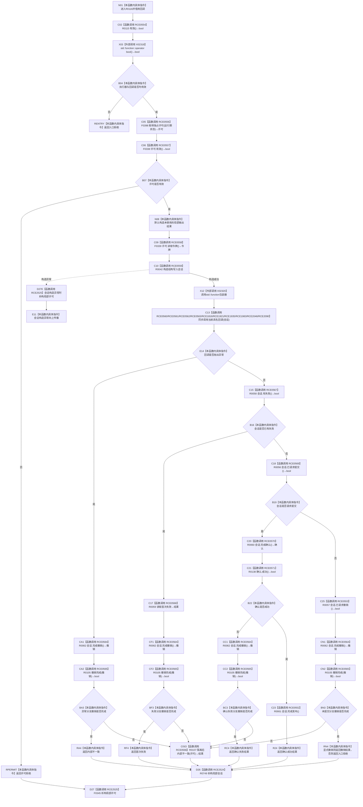

# CF-L8-0008 结构写入执行器执行无参与者重载现状流程图

图类型：现状流程图
代码版本：`73cc1af758e041519fa27c1dd57b9d5d07e3405a`
源码事实提交：`3920a74638264f9f539d50f32f3c9fe5fb1982ab`
源码 blob：`292e602cef1dd658ac2b507a3cc9ced7270a4a86`
覆盖文件：`海中鱼巣/核心/执行器.结构写入.ixx:74-111`
唯一根函数：R0116
完整签名：`海中鱼巣::结构写入结果 海中鱼巣::结构写入执行器::执行(const std::function<void(海中鱼巣::结构写入会话&)>& 回调) const`
参数：`回调` 为 const 非拥有 `std::function` 借用；其目标在十种当前调用语境中唯一解析
返回结果：入口/许可拒绝、首次失败、确认结果、显式撤销结果、内部不一致，或未提交时的入口拒绝；会话构造异常可向上传播
已登记调用方：R0340/R0409/R0432/R0454/R0633/R0651/R0652/R0668/R0689/R0701，经 RCE1079/RCE1284/RCE1341/RCE1404/RCE1815/RCE1920/RCE1934/RCE1982/RCE2045/RCE2089
直接项目函数：RCE0554→R0115、RCE0556→F0398、RCE0557→F0338、RCE0558→F0339、RCE0559→R0042、RCE0564→R0062、RCE0565→R0105、RCE0566→R0107、RCE0567→R0058、RCE0568→R0059、RCE0569→R0056、RCE0570→R0060、RCE0571→R0138、RCE0552→R0061、RCE0553→R0057；回调边 RCE0560→R0341、RCE0561→R0410、RCE0562→R0433、RCE0563→R0455、RCE1816→R0634、RCE1921→R0655、RCE1935→R0656、RCE1983→R0678、RCE2046→R0696、RCE2090→R0708；新增稳定 RCE2524→R0749、RCE2525→F0345
外部边界：X02318 `std::function::operator bool()`；X02320 `std::function::operator()`
停用外部误分类：X02319 与 RCE0556 对同一调用表达式重复记账，不属于当前边界
回调登记：RCB0014/RCB0015/RCB0016/RCB0020/RCB0030/RCB0028/RCB0029/RCB0031/RCB0033/RCB0034
未解析项目调用：0
逐行映射表：`流程图/代码流程图/L8/CF-L8-0008_结构写入执行器执行无参与者重载_逐行代码映射表.md`
结构读取与写入：在独占许可内构造会话，由回调形成候选并按失败、确认、发布或撤销路径收口；撤销不完整时请求隔离
验证输出：74—111 行完整映射；10 条项目入边、27 条项目出边、2 个当前外部边界、10 项回调登记
不得作为施工许可：是

## 流程图

## 当前边界

- X02320 是 `std::function` 包装器边界；其十种当前真实目标分别由 RCE0560/RCE0561/RCE0562/RCE0563/RCE1816/RCE1921/RCE1935/RCE1983/RCE2046/RCE2090 与 RCB0014/0015/0016/0020/0030/0028/0029/0031/0033/0034 分账。X02319 与 RCE0556 重复，已停用且不属于当前边界。
- 新增稳定 RCE2524/RCE2525 表达局部资源逆构造：会话成功构造后的全部退出先析构会话再析构许可；许可无效只析构许可；会话构造抛出时也析构许可。
- 回调异常由第83—88行捕获并先撤销会话；会话构造异常不在该 try 范围内，按当前函数合同向上传播。
