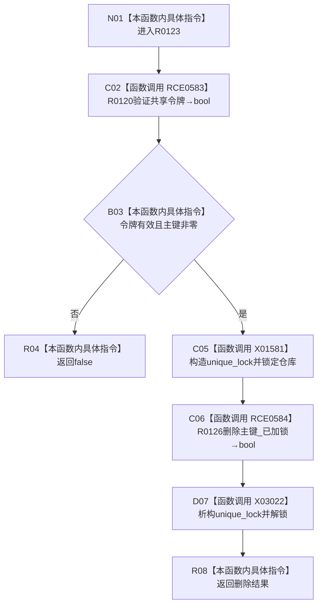

# CF-L8-0009 索引仓库删除主键带令牌重载现状流程图

图类型：现状流程图
代码版本：`3920a74638264f9f539d50f32f3c9fe5fb1982ab`
源码 blob：`8874312f67f19b220a08b1397c6103396878513d`
覆盖文件：`海中鱼巣/核心/索引仓库.cpp:298-302`
唯一根函数：R0123
完整签名：`bool 海中鱼巣::索引仓库::删除主键(std::uint64_t 主键, const 海中鱼巣::结构事务令牌& 令牌)`
参数：主键按值；令牌为 const 非拥有借用
返回结果：共享令牌有效且主键非零时返回已加锁删除结果，否则 `false`
已登记调用方：RCE2532（R0750）；RCE1587 已改连 R0750
直接项目函数：RCE0583→R0120；RCE0584→R0126；RCE0582 已停用
外部边界：X01581 unique_lock 构造；X03022 unique_lock 析构；未解析项目调用：0
调用图：`流程图/主程序可达调用关系/01_main可达项目调用边表.md`
逐行映射表：`流程图/代码流程图/L8/CF-L8-0009_索引仓库删除主键带令牌重载_逐行代码映射表.md`
验证输出：298—302 行完整映射；不得作为施工许可：是

当前边界：源码第299行不存在 F0630 调用，RCE0582 不进入本图。
