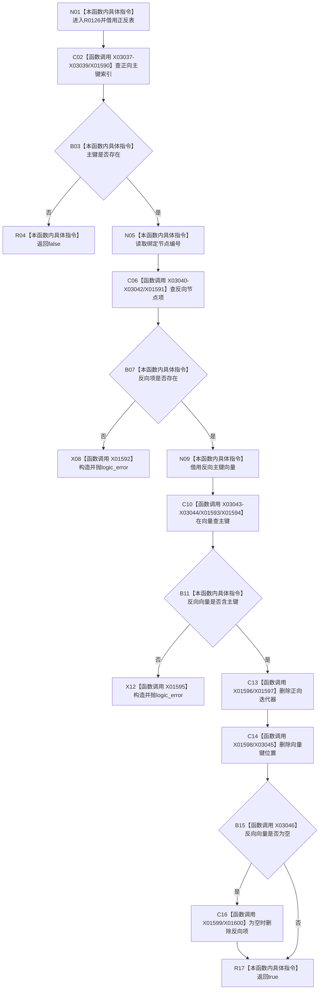

# CF-L8-0010 索引仓库删除主键已加锁现状流程图

图类型：现状流程图
代码版本：`3920a74638264f9f539d50f32f3c9fe5fb1982ab`
源码 blob：`8874312f67f19b220a08b1397c6103396878513d`
覆盖文件：`海中鱼巣/核心/索引仓库.cpp:68-88`
唯一根函数：R0126
完整签名：`bool 海中鱼巣::{匿名命名空间@索引仓库.cpp}::删除主键_已加锁(std::unordered_map<std::uint64_t,海中鱼巣::主键绑定记录>& 主键索引, std::unordered_map<std::uint64_t,std::vector<std::uint64_t>>& 节点主键组, std::uint64_t 主键)`
参数：正向表、反向表为调用方已持锁的可写借用；主键按值
返回结果：主键未命中时 `false`；正反索引一致并完成删除时 `true`；不一致时抛 `std::logic_error`
已登记调用方：RCE0584、RCE0590、RCE2534
直接项目函数：无
外部边界：X01590、X01591、X01592、X01593、X01594、X01595、X01596、X01597、X01598、X01599、X01600、X03037、X03038、X03039、X03040、X03041、X03042、X03043、X03044、X03045、X03046
未解析项目调用：0
调用图：`流程图/主程序可达调用关系/01_main可达项目调用边表.md`
逐行映射表：`流程图/代码流程图/L8/CF-L8-0010_索引仓库删除主键已加锁_逐行代码映射表.md`
结构读取与写入：先验证正向项及反向向量对应键存在，再依次删除正向记录、反向向量键和空反向项
内部错误：缺反向项或反向向量缺主键时抛逻辑错误，不进行部分删除
验证输出：68—88 行完整映射；3条入边、0条项目出边、21个外部边界
不得作为施工许可：是

当前边界：X03045 为向量 `erase` 本体，X01598 为其 const_iterator 参数生命周期；删除前两项一致性检查均通过后才开始写表。
