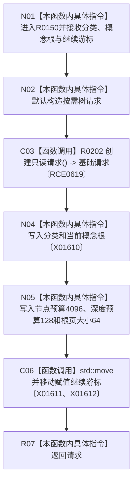

# CF-L8-0011 创建按需树请求现状流程图

图类型：现状流程图
代码版本：`3920a74638264f9f539d50f32f3c9fe5fb1982ab`
源码 blob：`fe9dad1eb3728c823beccf305c783be96a3df33d`
覆盖文件：`海中鱼巣/界面/控制面板窗口.cpp:100-113`
唯一根函数：R0150
完整签名：`控制面板按需树请求 海中鱼巣::{匿名命名空间@控制面板窗口.cpp}::创建按需树请求(控制面板树分类 分类, std::optional<节点句柄> 当前概念根, std::optional<控制面板根页游标> 继续游标)`
参数：分类按值传入；当前概念根和继续游标按值传入并由局部请求接管
返回结果：返回填入只读基础请求、分类、概念根、预算、页大小和游标的按需树请求
已登记调用方：RCE0684（R0176，`控制面板窗口.cpp:323`）
直接项目函数：R0202（RCE0619，创建只读请求）
外部边界：X01610、X01611、X01612；未解析项目调用：0
调用图：`流程图/主程序可达调用关系/01_main可达项目调用边表.md`
逐行映射表：`流程图/代码流程图/L8/CF-L8-0011_创建按需树请求_逐行代码映射表.md`
偏差清单：无
依据提交 / 结构化消息：当前源码、RCE0684、RCE0619、X01610—X01612
结构读取与写入：只构造返回材料，不修改仓库或运行期机器事实
逻辑内返回：不适用
生命周期与资源释放：继续游标移动到返回请求
异常：未声明 `noexcept`
验证输出：100—113 行完整映射；1 条项目入边、1 条项目出边、3 个外部边界
不得作为施工许可：是
不得宣称：请求材料构造证明按需树已经读取或显示

## 流程图

## 当前边界

- 预算和页大小是本函数写入返回材料的固定值。
- 本函数不执行查询，不读取树结构，也不裁决请求结果。
