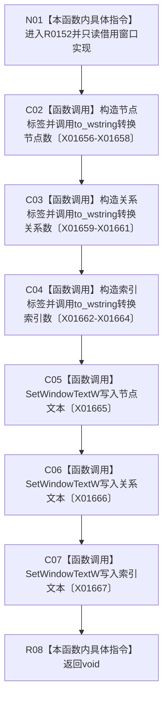

# CF-L8-0012 更新总览控件现状流程图

图类型：现状流程图
代码版本：`3920a74638264f9f539d50f32f3c9fe5fb1982ab`
源码 blob：`fe9dad1eb3728c823beccf305c783be96a3df33d`
覆盖文件：`海中鱼巣/界面/控制面板窗口.cpp:1136-1143`
唯一根函数：R0152
完整签名：`void 海中鱼巣::控制面板窗口::窗口实现::更新总览控件() const`
参数：无显式参数；只读借用 `this`
返回结果：`void`
已登记调用方：RCE0626（R0151）、RCE0658（R0164）
直接项目函数：无
外部边界：X01656、X01657、X01658、X01659、X01660、X01661、X01662、X01663、X01664、X01665、X01666、X01667；未解析项目调用：0
调用图：`流程图/主程序可达调用关系/01_main可达项目调用边表.md`
逐行映射表：`流程图/代码流程图/L8/CF-L8-0012_更新总览控件_逐行代码映射表.md`
偏差清单：无
依据提交 / 结构化消息：当前源码、RCE0626、RCE0658、X01656—X01667
结构读取与写入：读取当前快照启动结构统计，只更新三个 Win32 文本控件
逻辑内返回：不适用
生命周期与资源释放：三个局部宽字符串在函数结束时释放
异常：未声明 `noexcept`
验证输出：1136—1143 行完整映射；2 条项目入边、0 条项目出边、12 个外部边界
不得作为施工许可：是
不得宣称：显示的数量文本裁决当前仓库事实或数据库事实

## 流程图

## 当前边界

- 三项值来自窗口当前快照，不在本函数内重新读取仓库。
- Win32 写文本结果未被检查。
