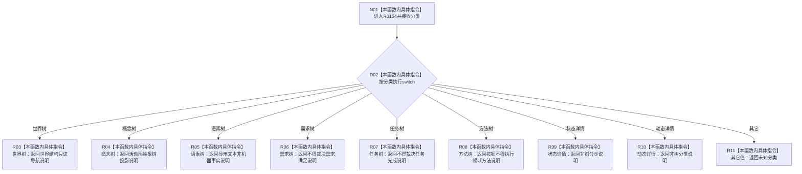

# CF-L8-0013 树分类说明现状流程图

图类型：现状流程图
代码版本：`3920a74638264f9f539d50f32f3c9fe5fb1982ab`
源码 blob：`fe9dad1eb3728c823beccf305c783be96a3df33d`
覆盖文件：`海中鱼巣/界面/控制面板窗口.cpp:115-135`
唯一根函数：R0154
完整签名：`const wchar_t* 海中鱼巣::{匿名命名空间@控制面板窗口.cpp}::树分类说明(控制面板树分类 分类)`
参数：`分类` 按值传入
返回结果：返回对应分类的人读只读说明字符串；未知值返回未知分类
已登记调用方：RCE0633（R0153，`控制面板窗口.cpp:1155,1188`）
直接项目函数：无
外部边界：无；未解析项目调用：0
调用图：`流程图/主程序可达调用关系/01_main可达项目调用边表.md`
逐行映射表：`流程图/代码流程图/L8/CF-L8-0013_树分类说明_逐行代码映射表.md`
偏差清单：无
依据提交 / 结构化消息：当前源码、RCE0633
结构读取与写入：无；只返回静态宽字符串
逻辑内返回：所有枚举项和未知兜底均为正常人读返回
生命周期与资源释放：返回静态字符串指针，不取得资源
异常：未声明 `noexcept`
验证输出：115—135 行完整映射；1 条项目入边、0 条项目出边、0 个外部边界
不得作为施工许可：是
不得宣称：说明字符串裁决任何树、需求、任务或方法机器事实

## 流程图

## 当前边界

- 返回内容全部为人读界面说明，不参与机器事实裁决。
