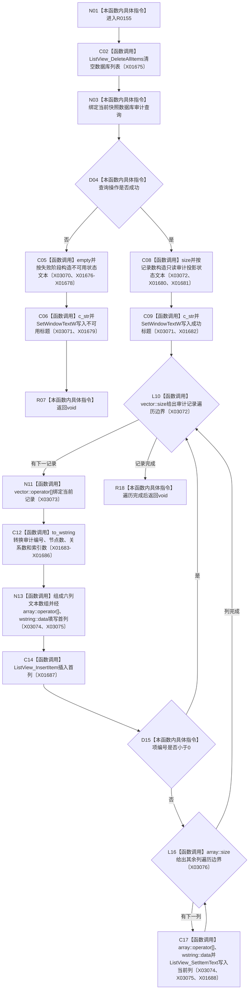

# CF-L8-0014 更新数据库控件现状流程图

图类型：现状流程图
代码版本：`3920a74638264f9f539d50f32f3c9fe5fb1982ab`
源码 blob：`fe9dad1eb3728c823beccf305c783be96a3df33d`
覆盖文件：`海中鱼巣/界面/控制面板窗口.cpp:1211-1245`
唯一根函数：R0155
完整签名：`void 海中鱼巣::控制面板窗口::窗口实现::更新数据库控件() const`
参数：无显式参数；只读借用 `this`
返回结果：`void`
已登记调用方：RCE0627（R0151）、RCE0717（R0198）
直接项目函数：无
外部边界：X01675、X01676、X01677、X01678、X01679、X01680、X01681、X01682、X01683、X01684、X01685、X01686、X01687、X01688、X03070、X03071、X03072、X03073、X03074、X03075、X03076；未解析项目调用：0
调用图：`流程图/主程序可达调用关系/01_main可达项目调用边表.md`
逐行映射表：`流程图/代码流程图/L8/CF-L8-0014_更新数据库控件_逐行代码映射表.md`
偏差清单：无
依据提交 / 结构化消息：当前源码、RCE0627、RCE0717、X01675—X01688、X03070—X03076
结构读取与写入：只读当前快照中的数据库审计查询，清空并重建列表显示和标题文本
逻辑内返回：数据库审计投影操作不成功时显示失败阶段并正常返回；列表项插入失败时跳过该项
生命周期与资源释放：局部字符串和 LVITEMW 材料按作用域释放
异常：未声明 `noexcept`
验证输出：1211—1245 行完整映射；2 条项目入边、0 条项目出边、21 个外部边界
不得作为施工许可：是
不得宣称：列表内容是运行期权威事实，或审计投影成功等于数据库恢复完成

## 流程图

## 当前边界

- 查询失败仍属于可显示状态：标题显示失败阶段后返回，不插入半结构列表项。
- 单项插入失败只跳过当前记录，不中止其余记录。
- 字符串、向量和数组访问使用顶层冻结的 X03070—X03076 稳定身份。
