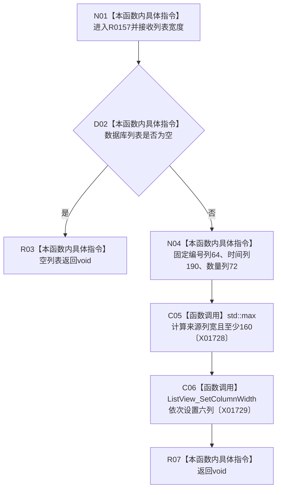

# CF-L8-0015 布局控件设置数据库列宽 lambda 现状流程图

图类型：现状流程图
代码版本：`3920a74638264f9f539d50f32f3c9fe5fb1982ab`
源码 blob：`fe9dad1eb3728c823beccf305c783be96a3df33d`
覆盖文件：`海中鱼巣/界面/控制面板窗口.cpp:1273-1287`
唯一根函数：R0157
完整签名：`void 海中鱼巣::控制面板窗口::窗口实现::布局控件() const::{lambda 设置数据库列宽@控制面板窗口.cpp:1273}::operator()(int 列表宽度) const`
参数：`列表宽度` 按值传入；通过引用捕获借用窗口实现成员
返回结果：`void`
已登记调用方：RCE0637（R0156，`控制面板窗口.cpp:1338`）
直接项目函数：无
外部边界：X01728、X01729；未解析项目调用：0
调用图：`流程图/主程序可达调用关系/01_main可达项目调用边表.md`
逐行映射表：`流程图/代码流程图/L8/CF-L8-0015_布局控件设置数据库列宽lambda_逐行代码映射表.md`
偏差清单：无
依据提交 / 结构化消息：当前源码、RCE0637、X01728、X01729
结构读取与写入：只调整数据库列表六列的界面宽度
逻辑内返回：数据库列表为空时正常返回
生命周期与资源释放：lambda 不取得控件所有权
异常：未声明 `noexcept`
验证输出：1273—1287 行完整映射；1 条项目入边、0 条项目出边、2 个外部边界
不得作为施工许可：是
不得宣称：列宽更新证明数据库记录存在或审计投影有效

## 流程图

## 当前边界

- 来源列吸收剩余宽度且下限为 160。
- 六次列宽设置的返回结果均未读取。
