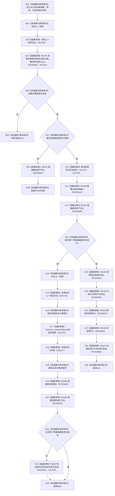

# CF-L8-0016 请求并重建当前树页现状流程图

图类型：现状流程图
代码版本：`3920a74638264f9f539d50f32f3c9fe5fb1982ab`
源码 blob：`fe9dad1eb3728c823beccf305c783be96a3df33d`
覆盖文件：`海中鱼巣/界面/控制面板窗口.cpp:1355-1388`
唯一根函数：R0158
完整签名：`bool 海中鱼巣::控制面板窗口::窗口实现::请求并重建当前树页(std::optional<节点句柄> 当前概念根, std::optional<控制面板根页游标> 当前页游标, std::vector<std::optional<控制面板根页游标>> 新根页历史, const wchar_t* 成功状态)`
参数：概念根、页游标和历史按值传入；成功状态为借用的只读宽字符串指针
返回结果：读取失败或新旧页面重建失败返回 false；未替换候选时返回 R0192 结果；完整重建成功返回 true
已登记调用方：RCE0648（R0160）、RCE0649（R0161）、RCE0650（R0163）
直接项目函数：R0176（RCE0638）、R0192（RCE0639）、R0189（RCE0640）、F0393（RCE0641）、R0193（RCE0642）、R0195（RCE0643）、R0153（RCE0644）、R0156（RCE0645）、R0167（RCE0646）
外部边界：X01730、X01731、X01732、X01733、X01734、X01735、X01736、X03077；未解析项目调用：0
调用图：`流程图/主程序可达调用关系/01_main可达项目调用边表.md`
逐行映射表：`流程图/代码流程图/L8/CF-L8-0016_请求并重建当前树页_逐行代码映射表.md`
偏差清单：无
依据提交 / 结构化消息：当前源码、RCE0648—RCE0650、RCE0638—RCE0646、X01730—X01736、X03077
结构读取与写入：尝试替换当前树快照和根页历史；界面重建失败时恢复旧快照与旧历史并重建旧页
逻辑内返回：按需候选未替换时只重建概念根下拉并返回其结果
生命周期与资源释放：保存旧快照/历史用于回退，新历史成功时移动到成员
异常：未声明 `noexcept`
验证输出：1355—1388 行完整映射；3 条项目入边、9 条项目出边、8 个外部边界
不得作为施工许可：是
不得宣称：返回 true 改变领域树机器事实；本函数只替换控制面板只读材料和控件

## 流程图

## 当前边界

- 读取失败发生在新历史提交前，直接返回 false。
- 新页界面重建失败会恢复旧快照、旧历史和旧分类索引，并尝试重建旧界面；无论旧界面恢复是否成功均返回 false。
- 1375 行 `clear()` 使用顶层冻结的 X03077 稳定身份。
