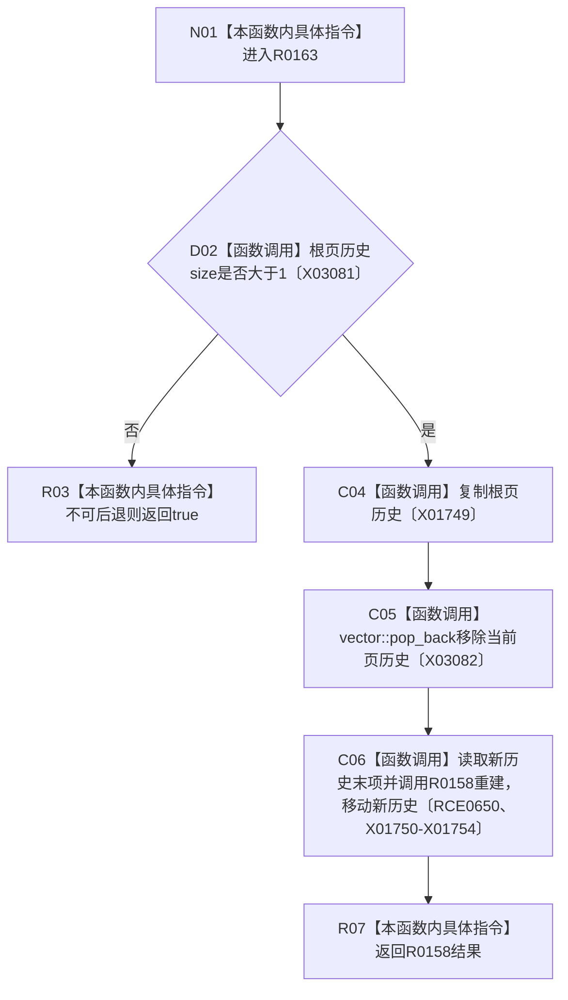

# CF-L8-0018 翻到上一根页现状流程图

图类型：现状流程图
代码版本：`3920a74638264f9f539d50f32f3c9fe5fb1982ab`
源码 blob：`fe9dad1eb3728c823beccf305c783be96a3df33d`
覆盖文件：`海中鱼巣/界面/控制面板窗口.cpp:1418-1429`
唯一根函数：R0163
完整签名：`bool 海中鱼巣::控制面板窗口::窗口实现::翻到上一根页()`
参数：无显式参数；借用并可更新 `this`
返回结果：历史不超过一项时返回 true；否则返回 R0158 的重建结果
已登记调用方：RCE0670（R0166，`控制面板窗口.cpp:1504`）
直接项目函数：R0158（RCE0650，请求并重建当前树页）
外部边界：X01749、X01750、X01751、X01752、X01753、X01754、X03081、X03082；未解析项目调用：0
调用图：`流程图/主程序可达调用关系/01_main可达项目调用边表.md`
逐行映射表：`流程图/代码流程图/L8/CF-L8-0018_翻到上一根页_逐行代码映射表.md`
偏差清单：无
依据提交 / 结构化消息：当前源码、RCE0670、RCE0650、X01749—X01754、X03081、X03082
结构读取与写入：复制历史、移除末项并读取新的末项；实际替换委托 R0158
逻辑内返回：没有可返回上一页时返回 true
生命周期与资源释放：新历史移动给 R0158
异常：未声明 `noexcept`
验证输出：1418—1429 行完整映射；1 条项目入边、1 条项目出边、8 个外部边界
不得作为施工许可：是
不得宣称：返回 true 一定发生过返回上一页

## 流程图

## 当前边界

- `pop_back` 仅在历史大于一项时执行。
- R0158 承担失败回退和界面更新。
