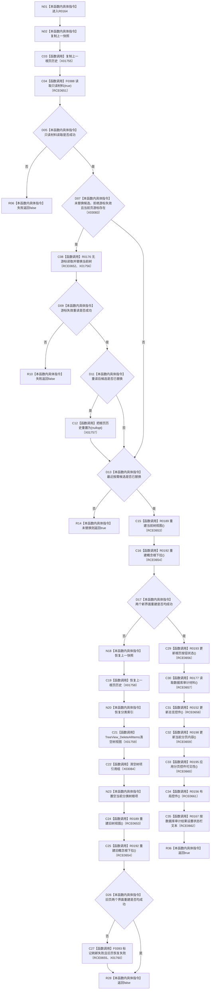

# CF-L8-0019 刷新显示材料现状流程图

图类型：现状流程图
代码版本：`3920a74638264f9f539d50f32f3c9fe5fb1982ab`
源码 blob：`fe9dad1eb3728c823beccf305c783be96a3df33d`
覆盖文件：`海中鱼巣/界面/控制面板窗口.cpp:1431-1473`
唯一根函数：R0164
完整签名：`bool 海中鱼巣::控制面板窗口::窗口实现::刷新显示材料()`
参数：无显式参数；借用并更新 `this`
返回结果：读取或重建失败返回 false；没有替换候选或完整刷新成功返回 true
已登记调用方：RCE0669（R0166，`控制面板窗口.cpp:1502`）
直接项目函数：F0388（RCE0651，读取只读材料）、R0176（RCE0652，读取并替换当前树）、R0189（RCE0653）、R0192（RCE0654）、F0393（RCE0655）、R0193（RCE0656）、R0177（RCE0657）、R0152（RCE0658）、R0198（RCE0659）、R0195（RCE0660）、R0156（RCE0661）、R0167（RCE0662）
外部边界：X01755、X01756、X01757、X01758、X01759、X01760、X03083、X03084；未解析项目调用：0
调用图：`流程图/主程序可达调用关系/01_main可达项目调用边表.md`
逐行映射表：`流程图/代码流程图/L8/CF-L8-0019_刷新显示材料_逐行代码映射表.md`
偏差清单：无
依据提交 / 结构化消息：当前源码、RCE0669、RCE0651—RCE0662、X01755—X01760、X03083、X03084
结构读取与写入：刷新窗口只读快照；游标失效时无游标重读当前树；界面重建失败时恢复旧快照和旧历史
逻辑内返回：读取成功但没有按需候选替换时返回 true
生命周期与资源释放：旧快照和旧历史保留为回退材料
异常：未声明 `noexcept`
验证输出：1431—1473 行完整映射；1 条项目入边、12 条项目出边、8 个外部边界
不得作为施工许可：是
不得宣称：刷新成功改变权威结构、恢复数据库或完成领域能力

## 流程图

## 当前边界

- 游标失效重读只在原请求没有替换候选、拒绝状态精确为游标失效且当前页游标存在时触发。
- 新页界面重建失败会恢复旧快照和历史并尝试重建旧页；无论旧页恢复结果如何均返回 false。
- 状态栏文本明确区分数据库审计投影可用与不可用，二者都不改变权威结构。
