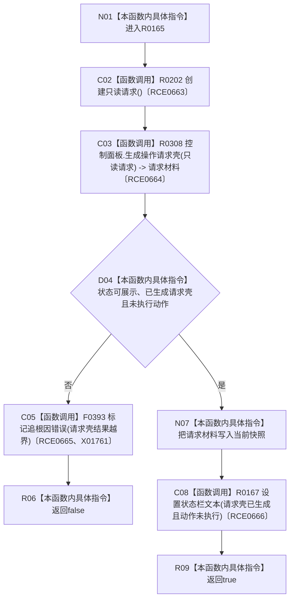

# CF-L8-0020 生成操作请求材料现状流程图

图类型：现状流程图
代码版本：`3920a74638264f9f539d50f32f3c9fe5fb1982ab`
源码 blob：`fe9dad1eb3728c823beccf305c783be96a3df33d`
覆盖文件：`海中鱼巣/界面/控制面板窗口.cpp:1475-1486`
唯一根函数：R0165
完整签名：`bool 海中鱼巣::控制面板窗口::窗口实现::生成操作请求材料()`
参数：无显式参数；借用并可更新 `this`
返回结果：请求壳合同不满足时返回 false；保存材料并更新状态栏后返回 true
已登记调用方：RCE0672（R0166，`控制面板窗口.cpp:1508`）
直接项目函数：R0202（RCE0663，创建只读请求）、R0308（RCE0664，生成操作请求壳）、F0393（RCE0665，标记追根因错误）、R0167（RCE0666，设置状态栏文本）
外部边界：X01761；未解析项目调用：0
调用图：`流程图/主程序可达调用关系/01_main可达项目调用边表.md`
逐行映射表：`流程图/代码流程图/L8/CF-L8-0020_生成操作请求材料_逐行代码映射表.md`
偏差清单：无
依据提交 / 结构化消息：当前源码、RCE0672、RCE0663—RCE0666、X01761
结构读取与写入：生成并保存只读操作请求壳材料；不执行动作
逻辑内返回：合同异常按当前代码标记追根因错误并返回 false
生命周期与资源释放：局部请求材料复制到当前快照
异常：未声明 `noexcept`
验证输出：1475—1486 行完整映射；1 条项目入边、4 条项目出边、1 个外部边界
不得作为施工许可：是
不得宣称：请求壳已执行领域动作或改变机器事实

## 流程图

## 当前边界

- 本函数明确检查 `已执行动作` 必须为假。
- 唯一保存的是人读操作请求材料，不执行领域写入。
