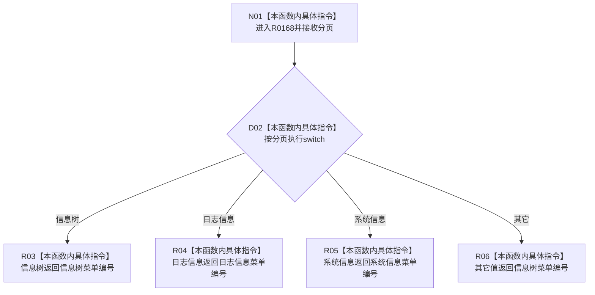

# CF-L8-0021 分页菜单编号现状流程图

图类型：现状流程图
代码版本：`3920a74638264f9f539d50f32f3c9fe5fb1982ab`
源码 blob：`fe9dad1eb3728c823beccf305c783be96a3df33d`
覆盖文件：`海中鱼巣/界面/控制面板窗口.cpp:154-164`
唯一根函数：R0168
完整签名：`int 海中鱼巣::{匿名命名空间@控制面板窗口.cpp}::分页菜单编号(控制面板分页 分页)`
参数：`分页` 按值传入
返回结果：返回对应分页菜单编号；未知枚举兜底返回信息树菜单编号
已登记调用方：RCE0707（R0194，`控制面板窗口.cpp:760`）
直接项目函数：无
外部边界：无；未解析项目调用：0
调用图：`流程图/主程序可达调用关系/01_main可达项目调用边表.md`
逐行映射表：`流程图/代码流程图/L8/CF-L8-0021_分页菜单编号_逐行代码映射表.md`
偏差清单：无
依据提交 / 结构化消息：当前源码、RCE0707
结构读取与写入：纯判断
逻辑内返回：未知分页兜底为信息树菜单编号
生命周期与资源释放：不取得资源
异常：未声明 `noexcept`
验证输出：154—164 行完整映射；1 条项目入边、0 条项目出边、0 个外部边界
不得作为施工许可：是
不得宣称：菜单编号映射证明菜单状态或分页内容已更新

## 流程图

## 当前边界

- 本函数只做枚举到菜单常量的映射。
