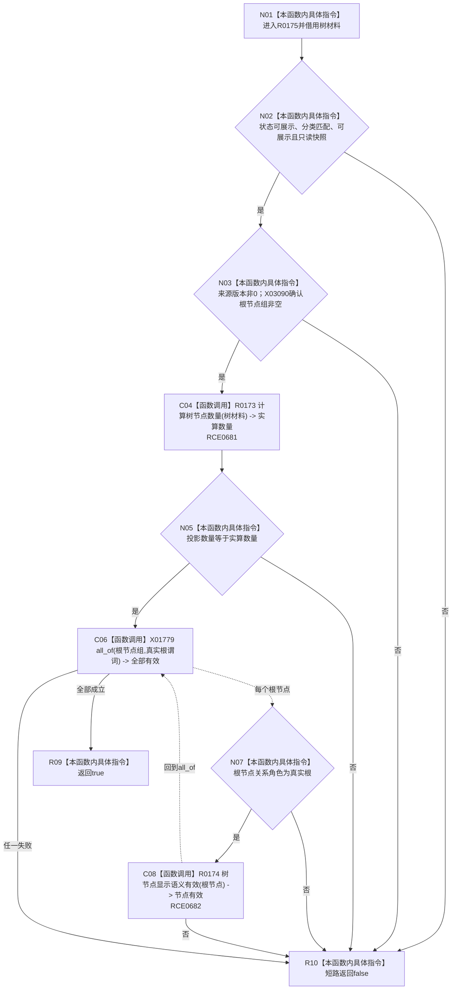

# CF-L8-0022 树结构显示语义有效现状流程图

图类型：现状流程图
代码版本：`3920a74638264f9f539d50f32f3c9fe5fb1982ab`
源码 blob：`fe9dad1eb3728c823beccf305c783be96a3df33d`
覆盖文件：`海中鱼巣/界面/控制面板窗口.cpp:233-248`
唯一根函数：R0175
完整签名：`bool 海中鱼巣::{匿名命名空间@控制面板窗口.cpp}::树结构显示语义有效(const 海中鱼巣::控制面板树结构材料& 树材料, 海中鱼巣::控制面板树分类 预期分类)`
参数：`树材料` 为只读借用；`预期分类` 按值传入
返回结果：结构状态、分类、展示标记、版本、数量和全部真实根语义均有效时返回 `true`
已登记调用方：RCE0687（R0176，342）
直接项目函数：RCE0681 → R0173；RCE0682 → R0174
被调函数流程图：`流程图/代码流程图/L9/CF-L9-0018_控制面板树结构节点数量_现状流程图.md`；`流程图/代码流程图/L9/CF-L9-0019_树节点显示语义有效_现状流程图.md`
外部边界：X01779 `std::all_of`、X03090 `vector::empty`；未解析项目调用：0
逐行映射表：`流程图/代码流程图/L8/CF-L8-0022_树结构显示语义有效_逐行代码映射表.md`
依据：关系发布基线 `010784a906e8283644a63a742151f6457a847c38` 与冻结源码
结构读写：只读树材料，不写结构
不得作为施工许可：是
不得宣称：显示语义有效证明材料来源版本已发布或数据库一致

## 流程图

## 当前边界

- 合取表达式按源码顺序短路，数量计算只在基础展示条件通过后执行。
- 每个根节点必须同时满足“真实根”角色和 R0174 的递归节点语义。
