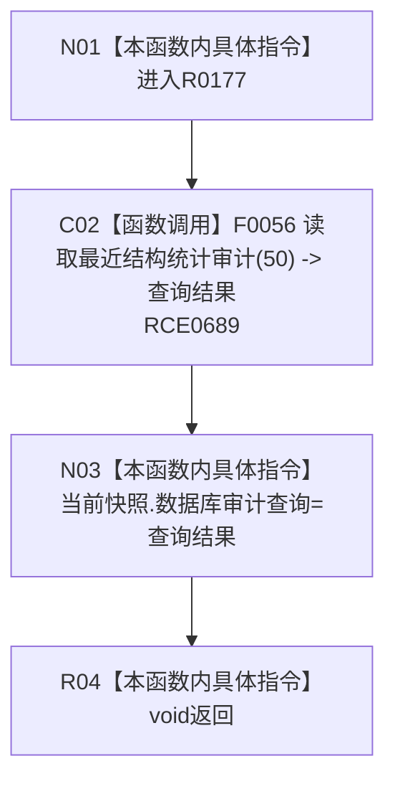

# CF-L8-0023 读取数据库审计材料现状流程图

图类型：现状流程图
代码版本：`3920a74638264f9f539d50f32f3c9fe5fb1982ab`
源码 blob：`fe9dad1eb3728c823beccf305c783be96a3df33d`
覆盖文件：`海中鱼巣/界面/控制面板窗口.cpp:418-420`
唯一根函数：R0177
完整签名：`void 海中鱼巣::控制面板窗口::窗口实现::读取数据库审计材料()`
参数：无显式参数；使用当前窗口实现的数据库适配与快照
返回结果：`void`
已登记调用方：RCE0625、RCE0657
直接项目函数：RCE0689 → F0056 `数据库.读取最近结构统计审计(50)`
外部边界：无；未解析项目调用：0
逐行映射表：`流程图/代码流程图/L8/CF-L8-0023_读取数据库审计材料_逐行代码映射表.md`
依据：关系发布基线 `010784a906e8283644a63a742151f6457a847c38` 与冻结源码
结构读写：用最近五十条审计查询结果替换窗口快照字段；不写数据库
不得作为施工许可：是
不得宣称：读到审计材料证明数据库结构恢复或业务写入完成

## 流程图

## 当前边界

- 固定请求最近 `50` 条结构统计审计材料。
- 函数只更新界面快照，不解释查询结果是否成功。
