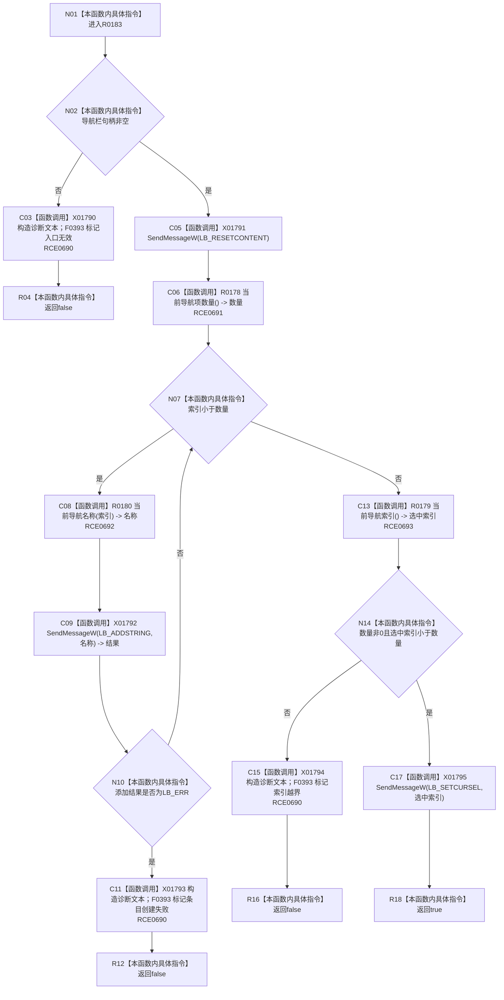

# CF-L8-0025 重建导航栏现状流程图

图类型：现状流程图
代码版本：`3920a74638264f9f539d50f32f3c9fe5fb1982ab`
源码 blob：`fe9dad1eb3728c823beccf305c783be96a3df33d`
覆盖文件：`海中鱼巣/界面/控制面板窗口.cpp:559-579`
唯一根函数：R0183
完整签名：`bool 海中鱼巣::控制面板窗口::窗口实现::重建导航栏()`
参数：无显式参数；使用窗口导航栏与导航状态
返回结果：导航栏重建并选择当前项时返回 `true`，入口无效、添加失败或索引越界时返回 `false`
已登记调用方：RCE0621、RCE0721
直接项目函数：RCE0690 → F0393；RCE0691 → R0178；RCE0692 → R0180；RCE0693 → R0179
外部边界：X01790—X01795；未解析项目调用：0
逐行映射表：`流程图/代码流程图/L8/CF-L8-0025_重建导航栏_逐行代码映射表.md`
依据：关系发布基线 `010784a906e8283644a63a742151f6457a847c38` 与冻结源码
结构读写：重置并重建 Windows 列表框内容和当前选择；失败时写诊断状态
不得作为施工许可：是
不得宣称：导航栏重建成功证明页面材料已刷新

## 流程图

## 当前边界

- 先清空现有列表，再逐项添加当前分页的名称。
- `LB_ADDSTRING` 任一失败即停止；设置当前选择的消息返回值未另行检查。
