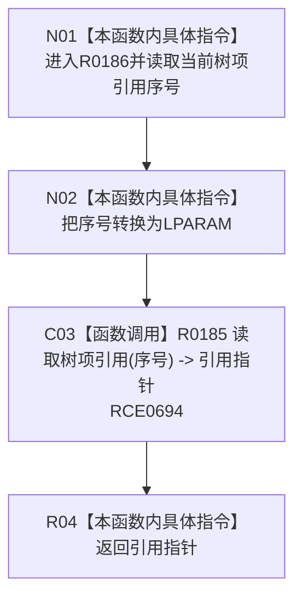

# CF-L8-0026 读取当前树项引用现状流程图

图类型：现状流程图
代码版本：`3920a74638264f9f539d50f32f3c9fe5fb1982ab`
源码 blob：`fe9dad1eb3728c823beccf305c783be96a3df33d`
覆盖文件：`海中鱼巣/界面/控制面板窗口.cpp:597-599`
唯一根函数：R0186
完整签名：`const 海中鱼巣::控制面板树项引用* 海中鱼巣::控制面板窗口::窗口实现::读取当前树项引用() const`
参数：无显式参数；只读当前树项引用序号
返回结果：返回 R0185 的只读借用指针或 `nullptr`
已登记调用方：RCE0632（R0153，1146）
直接项目函数：RCE0694 → R0185
被调函数流程图：`流程图/代码流程图/L7/CF-L7-0043_读取树项引用_现状流程图.md`
外部边界：无；未解析项目调用：0
逐行映射表：`流程图/代码流程图/L8/CF-L8-0026_读取当前树项引用_逐行代码映射表.md`
依据：关系发布基线 `010784a906e8283644a63a742151f6457a847c38` 与冻结源码
结构读写：只读当前序号和引用组
不得作为施工许可：是
不得宣称：当前引用非空证明当前树选择仍可展示

## 流程图

## 当前边界

- 本函数不新增范围规则，完全复用 R0185 的 1 基序号检查。
