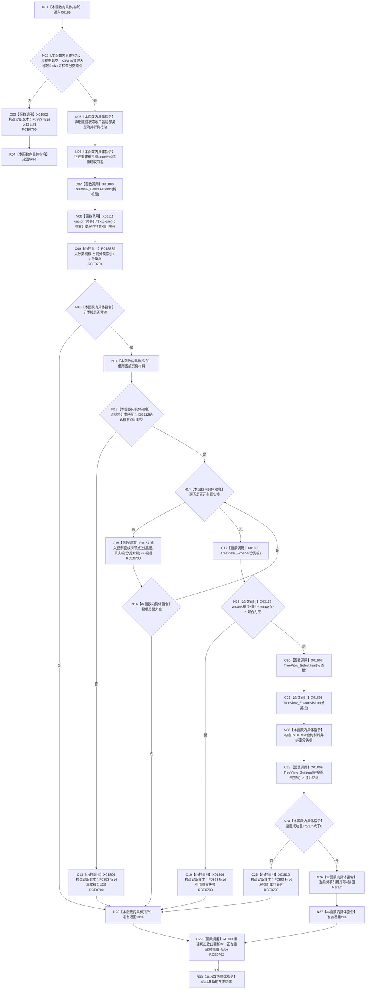

# CF-L8-0027 重建当前树视图现状流程图

图类型：现状流程图
代码版本：`3920a74638264f9f539d50f32f3c9fe5fb1982ab`
源码 blob：`fe9dad1eb3728c823beccf305c783be96a3df33d`
覆盖文件：`海中鱼巣/界面/控制面板窗口.cpp:641-690`
唯一根函数：R0189
完整签名：`bool 海中鱼巣::控制面板窗口::窗口实现::重建当前树视图()`
参数：无显式参数；使用当前树候选、分类、树控件和引用组
返回结果：分类根、全部真实根及根引用读回成功时返回 `true`，任一入口 / 插入 / 读回异常返回 `false`
已登记调用方：RCE0622、RCE0640、RCE0653、RCE0736
直接项目函数：RCE0700 → F0393；RCE0701 → R0188；RCE0702 → R0190；RCE0703 → R0187
外部边界：X01802—X01810、X03110—X03113；未解析项目调用：0
逐行映射表：`流程图/代码流程图/L8/CF-L8-0027_重建当前树视图_逐行代码映射表.md`
依据：关系发布基线 `010784a906e8283644a63a742151f6457a847c38` 与冻结源码
结构读写：清空并重建 Windows 树控件和引用组；局部收口器保证离开重建区后清除正在重建标志
不得作为施工许可：是
不得宣称：界面树重建成功证明底层关系或节点事实发生写入

## 流程图

## 当前边界

- 入口检查失败发生在收口器构造前，不调用 R0190；653 行之后的六个返回点均经 RCE0702 析构收口。
- 642、655、665、675 行的四个容器调用已分别绑定 X03110—X03113。
