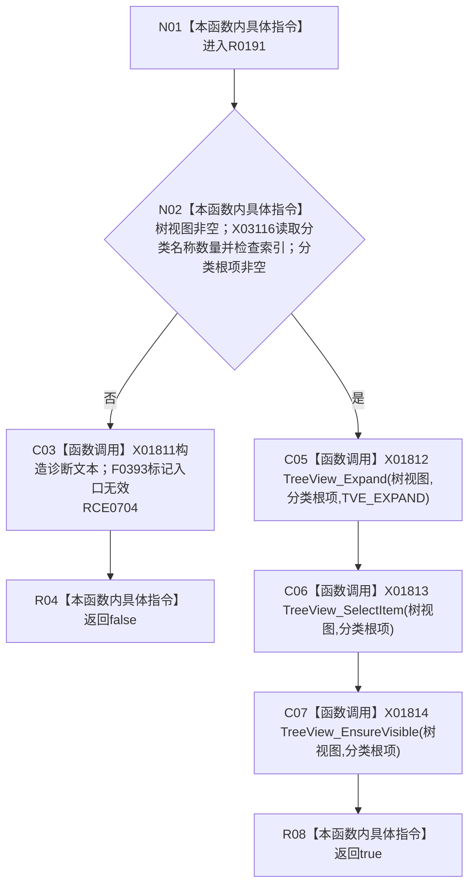

# CF-L8-0028 定位当前分类树根现状流程图

图类型：现状流程图
代码版本：`3920a74638264f9f539d50f32f3c9fe5fb1982ab`
源码 blob：`fe9dad1eb3728c823beccf305c783be96a3df33d`
覆盖文件：`海中鱼巣/界面/控制面板窗口.cpp:692-703`
唯一根函数：R0191
完整签名：`bool 海中鱼巣::控制面板窗口::窗口实现::定位当前分类树根()`
参数：无显式参数；读取树控件、分类索引、分类名称与当前分类树根项
返回结果：入口有效并完成展开、选择和可见性调用时返回 `true`；入口无效时返回 `false`
已登记调用方：RCE0722、RCE0733
直接项目函数：RCE0704 → F0393
外部边界：X01811—X01814、X03116；未解析项目调用：0
逐行映射表：`流程图/代码流程图/L8/CF-L8-0028_定位当前分类树根_逐行代码映射表.md`
依据：关系发布基线 `010784a906e8283644a63a742151f6457a847c38` 与冻结源码
结构读写：只修改 Windows 树控件的展开、选择和可见状态
不得作为施工许可：是
不得宣称：定位界面树根会改变底层节点或关系事实

## 流程图

## 当前边界

- 三个 CommCtrl 调用的返回值未被代码读取；当前函数以入口合同成立作为布尔成功口径。
- 入口异常被归为前置通过后的内部界面状态错误并交给 F0393 记录。
